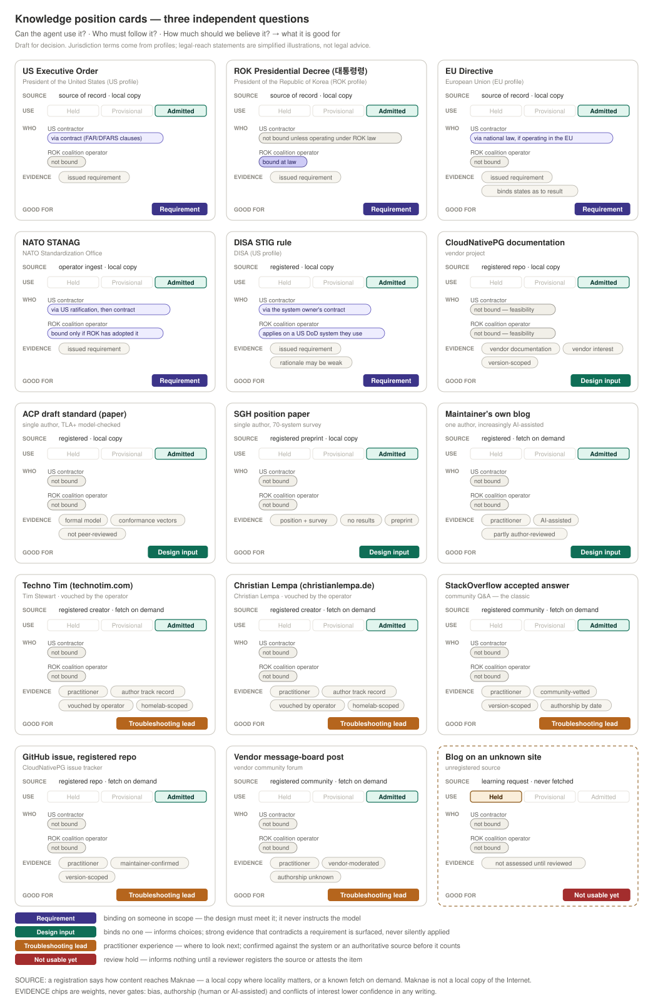

# A graph-native lake and memory router for Maknae

**Status:** Exploratory idea. This is not an ADR, a specification, an implementation plan, or a choice of storage engine or binary format.

**Origin:** Maintainer discussion, 2026-10-06. The intended destination is a Rust successor to the current Knowledge Lake, with Maknae using its graph as the native route to documents, media, and memory. Markdown may remain useful during extraction or for human export; it need not define the stored object model.

**Companions:** The [Knowledge Lifecycle Contract](knowledge-lifecycle-contract.md) §8.1 defines the intake routes this note's walkthrough uses. [Graph-driven activity](plan-as-graph.md) applies the same record envelope to the kernel's activity and plan graphs, so the Agent Daemon can correlate what it retrieved with what it did.

## The opportunity

The current lake already knows more than a directory of Markdown files can express conveniently. Knowledgebase issue #619-A added a typed edge vocabulary, per-edge provenance, and curation checks on top of existing stable document identities. The compiled `AUTHORITY_MAP.json` and query operations can resolve authority, supersession, topic, and routing relationships. Issue #585's PDF extractor can record an image's placement in its source PDF, but the current checkout has no generated image placement manifests, and the retrieval path does not make the extracted assets useful to an agent. Those assets are a concrete example of information the lake holds without being able to explain or show it in context. In the 2026-10-06 local checkout, the compiled authority artifact has 1,262 nodes and 290 edges in about 680 KB, while the corpus contains about 63,000 image assets. This is a snapshot, not a forecast of either workload's growth.

The idea is to treat **documents, their meaningful parts, media, memories, and relationships as addressable objects in one governed graph**. Maknae could follow that graph to find a source, expand to related material, and return a bounded package of text, a table, or a relevant figure with its source location. The model would receive an authorized view of the result, rather than a dump of the graph or an asset directory.

## A possible logical shape

A document could own sections, passages, tables, figures, and source files. A figure would be linked to the page or region where it appears, its nearby text or caption, and any derived description or OCR. A memory could have a subject, lineage, and links to the documents or events that support it. Relationships such as `supersedes`, `governs`, `cites`, and `relates_to` would retain their type and provenance. Search terms, vectors, and adjacency lists would be indexes over these objects, not substitutes for their identities.

Every releasable object needs its own trustworthy DCS label and handling metadata, including extracted text, image bytes, descriptions, memories, and relationship edges. An edge between two public documents could itself disclose a sensitive corporate relationship. Search results can also reveal a hidden node's title, existence, count, or ranking change before any document is opened. The graph therefore supplies candidate information; `maknaed` remains the sole policy decision point and decides what may be released to a subject. Labels cannot be taken from a PDF's text or another untrusted extraction result as an authorization claim. Derived parts must remain linked to their source and its governing label, with any stricter label preserved.

This describes a goal, not current capability. The Knowledge Lake reserves `dcs_label` for later work, and Maknae's classification request key is not yet stamped from content. The proposed graph needs a trustworthy label source and integrity check before it can release labeled parts.

This is a **logical model**, not a decision to put all bytes in one file. A binary graph might contain metadata, adjacency and search indexes while content and images live in separately addressed objects. It might instead package some or all content together. The right physical layout depends on update patterns, retrieval latency, corruption recovery, label boundaries, and the cost of keeping indexes consistent. Markdown could remain an extraction intermediate or an export view without limiting what a document object can represent.

## One graph model, two spaces

The shared reference space holds policy, standards, STIGs, vendor manuals, and their addressable parts. It is common infrastructure for all users, though each user's view is still filtered by Maknae's access decision and the item's labels. A user space holds that user's preferences, episodes, corrections, learned lessons, and situation cues. Its memories are context about the user, not citable policy authority. The current `~/claude-memory` store's `_global/memory` is global across **one user's projects**, not a license to share it across people.

A private memory can point to a shared source by stable ID: “this lesson applied when working with this STIG” or “this vendor guide helped with this task.” The shared graph never gains an edge back into an individual's memory, and a private edge cannot target another user's space. A private edge can itself disclose the user's activity, so it carries its own label and provenance; the shared target must also be authorized before the edge or target is exposed. This lets user experience improve retrieval without promoting a user's preference or recollection into governing authority.

An illustrative record shape, deliberately above the choice of on-disk encoding:

```rust
enum GraphSpace { Shared, User(SubjectId), Kernel } // SubjectId is bound by the trust plane; Kernel holds activity records (plan-as-graph.md §5.4)
enum MemoryKind { Preference, Episode, Lesson, Procedure }
enum NodeKind {
    Document, SourceArtifact, Passage, Table, Figure,
    StructuredElement(SemanticKind), Memory(MemoryKind), SituationCue,
}

struct ContentDescriptor {
    media_type: MediaType,       // actual bytes: PDF, Markdown, JSON, YAML, XML, PNG...
    dialect: Option<FormatId>,  // e.g. OpenAPI 3.1 or JSON Schema 2020-12
    bytes: ContentRef,          // original or derived, never an implicit text flattening
    locator: Option<LocatorRef>, // page/region, line span, JSON Pointer, XPath...
}

struct NodeRecord {
    id: NodeId,                 // stable identity, independent of path or title
    space: GraphSpace,
    kind: NodeKind,
    content: Option<ContentDescriptor>,
    label: LabelRef,            // integrity-bound to this object revision
    provenance: ProvenanceRef,
    revision: RevisionId,
}

struct EdgeRecord {
    id: EdgeId,
    space: GraphSpace,
    from: NodeId,
    to: NodeId,
    relation: RelationKind,     // authority, citation, context, cue, association
    label: LabelRef,            // an edge may be sensitive independently
    provenance: ProvenanceRef,  // assertion source, rationale, confidence if relevant
    revision: RevisionId,
}
```

This adds an explicit distinction between **what bytes are stored** (`media_type`), **which language or schema they use** (`dialect`), and **what the addressed part means** (`NodeKind`/`SemanticKind`). A file extension or an HTTP `Content-Type` header is a claim to compare with the bytes, not the sole type authority. `SemanticKind` would use a governed, versioned vocabulary rather than one Rust enum variant for every vendor format. Each independently releasable representation is a node with its own label and provenance; `derived_from` edges connect normalized data, text renderings, OCR, previews, and embeddings back to the source bytes. The sketch does not require the binary store to inline those bytes.

## Content types are first-class

The immutable source artifact preserves the exact Markdown, JSON, XML, YAML, PDF, image, or other bytes and their digest. A parser may add addressable semantic parts without replacing the original. For Markdown that could be headings and passages; for JSON or YAML, objects, fields, arrays, and schema definitions; for XML, namespace-qualified elements and types; for Swagger/OpenAPI, paths, operations, parameters, request/response schemas, and references. A YAML file can be an OpenAPI document, a Kubernetes manifest, or ordinary configuration: its syntax alone does not determine its meaning. The graph records the recognized dialect and parser version, and keeps the original available for verification or re-extraction.

The locator follows the format. A PDF passage can point to a page and region, a Markdown heading to a source span, a JSON Schema property to a JSON Pointer, and an XML type to a namespace-aware path. A typed edge can say an OpenAPI operation `uses_schema` or a Kubernetes manifest `declares_resource`; a text-search index may hold a readable rendering, but structured queries should resolve the actual operation, property, type, or resource. For example, “Which fields does this API operation require?” should return the required fields from the parsed schema with source pointers and version, not only a paragraph that happened to mention them.

Formats without a supported parser can still be stored as opaque source artifacts if policy permits, with basic metadata and no invented internal graph structure. Parser availability is therefore distinct from the file's permission to enter the lake and from the user's permission to retrieve it. Format-specific parsers and indexes are untrusted extraction components; the kernel retains the label and release decisions. A derived Markdown view can help an LLM read a schema, but it must not silently discard constraints, references, namespaces, or ordering that matter to that format.

Shared authority edges and personal associative edges use the same record envelope but different vocabularies and rules. `~/knowledgebase` already distinguishes typed authority and retrieval relationships. `~/claude-memory` distinguishes structural edges (`refines`, `operationalizes`, `boundary`, `companion`) from softer associative edges with a `why` and confidence. Its graph-memory note adds situation cues and learned lessons: a cue can point to a short directive, and a private lesson can point to the shared source that informed it. Some lessons are relationships; a procedure with its own content needs a memory node. The useful hot-path view may be a small, derived cue-to-directive index, while the graph remains the reviewable record.

One plausible physical arrangement is a read-mostly shared graph snapshot, separate mutable user segments, content objects, and rebuildable search and cue indexes. A query would compose the shared graph with **only the authenticated subject's** user segment, then obtain kernel decisions for candidates before disclosing a result. Those pieces could be packaged differently after measurement; the two-space boundary is more important than whether there is one binary file or several. Cue recall could observe an action context and offer a short, authorized memory at the point of use, but it must not turn a PDP verdict into an advice channel or let a memory grant a capability.

## File access and graph operations

A binary store is plausible, but **a grant to open a mixed-label graph file is a grant to read its raw bytes**, not a node-level access decision. The CLI should ask `maknaed` for graph operations and receive only authorized records or content. It should not get the file descriptor for a shared snapshot that contains higher-labeled passages, sensitive edges, or other users' memories. Filesystem ownership and permissions protect the store as a whole; the kernel's per-request decision protects each result. An untrusted graph worker could find candidates behind a narrow interface, but it could neither decide their release nor commit a label transition.

The CLI's useful operations would be typed requests: search, read, traverse, fetch a figure, propose an ingest or memory change, revise a record, and request a deletion. `maknaed` would bind the caller to a subject and graph space, decide access to every disclosed object and edge, and broker accepted changes with integrity and audit. “Update a label” is a governed transition, not an ordinary edit to a binary record. The ingestion model and personal-memory logic can propose changes, but they do not write the authoritative store directly. This follows the [Knowledge Lifecycle Contract](knowledge-lifecycle-contract.md#61-the-kernel-is-the-integrity-root-for-label-state-at-every-tier), which requires writes to label-bearing corpus state to be brokered through a kernel API.

`/usr/share/maknae/lake` could be a location for an **immutable, packaged seed** if packaging makes that useful. It is a poor conceptual home for the active graph that must accept CRUD operations. The active shared store and per-user memory would live in protected state locations selected for Linux and macOS packaging, with separate ownership and recovery rules; this note does not choose their paths. A read-mostly binary snapshot might be accompanied by a transaction journal, content objects, and rebuildable indexes, rather than being one mutable file. Atomicity across a record, its label, relationships, and indexes matters more than the number of files.

The current [isolation contract](../packaging/isolation-contract.md) describes a CLI-readable **read-only curated lake mount**. That can coexist with this idea as an input or public slice, but it is not a safe access model for a future mixed-label, mutable graph. If this design advances, the direct-read mount assumption needs explicit review against the kernel's integrity and disclosure boundaries. Keeping graph bytes inside `maknaed` would simplify those boundaries but expand its trusted parser and storage code; putting storage in another process would require a narrow, authenticated result-and-commit interface. Both are still design choices.

### Segmenting storage by label

One proposal is to store each label in its own file and join across files only when a subject is authorized for both. That is right at a **coarse** grain and wrong at the full-label grain. Partition selection must also never become the access decision.

**What a file boundary buys, and what it does not.** No subject opens graph files; `maknaed` mediates every read. Per-label files therefore add no subject-facing control, and one daemon process that can open every partition gains no isolation from a parser bug in itself. The real gains lie elsewhere:

- **Index isolation across levels.** A search index built over mixed labels leaks through its statistics: term and document frequencies, ranking order, result counts, and vector-neighbourhood structure. Filtering records after ranking removes the record but leaves its effect on the ranking. A separate index per partition removes that channel **between levels**. Records at one level with different releasability or compartments still share an index, so the channel remains within a level. In a multinational enclave, where releasability is the main axis, that residual needs its own answer: per-releasability indexes, or ranking that ignores statistics the subject could not see.
- **Custody, keys and export.** Partitions can carry separate OS ownership and encryption keys. A replica for a lower-ceiling enclave can be built by copying the partitions it may hold, rather than by filtering records and trusting the filter. This is the [KLC](knowledge-lifecycle-contract.md) §12 import ceiling check, applied on export.
- **Recovery blast radius.** A corrupt partition stays contained.
- **A future process boundary.** If storage later moves into per-level workers with distinct OS credentials, the file boundary becomes a real isolation boundary. That buys containment at the cost of more processes and more trusted code, and it is a decision for later.

**Why not one file per full label.** A label is a lattice point: level × categories × releasability × handling, plus operator-defined categories ([ADR-0022](adr/ADR-0022-classification-policy-as-data.md)). Partitioning on the full label is combinatorial and sparse. Span-level labels would scatter one document across many files. Every label transition would become a move between files that needs a multi-file atomic commit, and edges carry labels of their own.

**The candidate partition key is `(GraphSpace, level)`.** The level comes from the boot-declared classification system, a small total order (four US levels, six AUS rungs). Every admitted record carries an explicit label from intake (KLC §8.1); content whose label could not be determined is labeled system high and lives in the top partition. Categories, releasability, handling and operator categories stay per-record, and the PDP decides them on every request. Each subject's user space is its own partition stack, and the kernel's activity space (see [Graph-driven activity](plan-as-graph.md) §5.4) is another.

**Cross-partition edges point down or sideways, never up.** An edge is stored in a partition whose level dominates both its endpoints and the edge's own label. No lower partition holds an identifier, pointer or count that reveals a higher-partition record. This is the same rule as shared-to-private, where the shared graph never gains an edge into a user's space, applied to levels. Its consequence is the property the proposal wants: a query for a subject cleared to level *L* opens exactly the partitions at or below *L*, plus that subject's own user space. Every edge the subject could follow is already inside them, so no traversal has to look upward to learn whether an edge exists.

**The pre-filter is not the decision.** Opening only dominated partitions narrows the candidate set; `maknaed` still decides every returned record and edge, including categories, need-to-know, handling and the task's authority requirement. If partition selection quietly became the control, the PDP would stop seeing the requests it should deny. That is the *deviation collapse* failure in [Graph-driven activity](plan-as-graph.md) §15.9, where instruments read green because the denials were filtered away upstream. Counterfactual requests for higher-partition records keep the decision path exercised.

**Label transitions that cross a level boundary are governed moves.** An upgrade moves the record up and must re-home any edge that would now point upward from below. A downgrade is a signed act ([KLC](knowledge-lifecycle-contract.md) §6) and is never automated. Both need a journal that commits across partitions atomically.

**Measure it.** The MVP benchmark should compare a partitioned store against one store with record filtering on cross-level traversal latency, update cost and index-leak exposure. The partition scheme is a hypothesis until those numbers exist.

## A graph-first MVP

The first vertical slice can start with an **already extracted** Knowledge Lake document, with `CNSSP_15_20161020.md` as a concrete fixture. It has a stable document ID, frontmatter, section anchors, and two extracted image assets. The importer would consume those existing artifacts and any selected, already-curated edges; PDF extraction and autonomous refresh are later work. A second fixture in JSON, YAML, or XML can test that the storage envelope preserves a different media type without requiring a complete parser for every format in the first slice. The first result is a usable graph, not a rewrite of the current extractor.

`graph.*` is a good **action namespace**, with individually decidable terms rather than a grant that means “all graph operations.” `graph.store.create` could initialize an empty versioned store under an operator or service capability. `graph.import` would atomically add a lake document and its initial nodes, edges, content references, labels, and provenance. `graph.node.create/read/update/delete` and `graph.edge.create/read/update/delete` cover subsequent authorized CRUD; `graph.search` and `graph.traverse` disclose only authorized results. Exact wire grouping can be smaller than the action vocabulary, but a search, content read, structural traversal, and mutation must not inherit one another's grants. A label change or source-authority assertion is a governed transition, not an ordinary node update. Initial store creation is operationally different from letting any graph contributor initialize or replace it.

The service's physical file I/O should use `maknae-io` and OS ownership, permissions, and confinement on Linux and macOS. An importer's access to a source file may invoke the existing `fs.read` policy and OS controls; the daemon's persistence of a permitted graph transaction uses its own storage identity and I/O boundary. **Do not grant a user `fs.write` to the graph directory as a substitute for `graph.node.update` or `graph.edge.delete`.** The former can bypass record-level authorization, labels, indexes, and audit. `fs.write` remains useful for ordinary user files and for packaging or administrative setup where applicable, but graph CRUD is mediated through typed operations.

For a minimum end-to-end proof, one subject imports the extracted CNSSP document; the graph reopens from its binary store with the same document ID, content bytes, section locators, media references, labels, and edges; that subject creates and revises a node and edge, then deletes a test node or edge with defined referential behavior. A separately authenticated subject with read access can search, traverse, and read the allowed document after the writer's session ends. A subject without the relevant grant cannot read it, and the reader cannot mutate it. The store survives restart and interrupted writes without exposing half a transaction. Updates create auditable revisions or tombstones rather than silently rewriting provenance-bearing history.

“Optimized binary” needs a measured claim. This slice could choose a simple versioned binary layout and benchmark import size, reopen time, exact-ID lookup, bounded traversal, and authorized read against the current Markdown plus compiled JSON baseline using the same fixtures. It should record the cost of an update and crash recovery as well as read speed; a faster lookup that makes safe CRUD expensive is not a clear win. The layout can change while Maknae is pre-release, but a format version, integrity checks, and a migration/rebuild path keep the experiment reviewable.

## Later walkthrough: ingest a local policy PDF, then answer another user

Suppose an authorized user runs `maknae ingest ~/Downloads/CNSSP_15_20161020.pdf` after raw-document extraction exists. This is a later path than the extracted-document MVP above. That file is present in the maintainer's local Downloads folder in this example: it is a nine-page PDF whose cover identifies it as *CNSS Policy 15*, dated 20 October 2016, *Use of Public Standards for Secure Information Sharing*. Its text says it supersedes the 2012 CNSS Policy 15 and CNSS Advisory Memorandum IA 02-15. These are **claims found in the submitted bytes**, not yet verified claims about this copy's origin, currentness, classification, or authority. The present Knowledge Lake already has this 2016 edition and a December 2024 edition; the latter's text says it supersedes the former. The lake's issuer registry recognizes CNSS `Policy` as a `directive` in the `cnss` peer domain, and the 2016 lake record carries `authority_level: 1`. These existing records are useful comparison material, but their metadata alone is not fresh proof that the submitted PDF is genuine.

1. **Admit the request.** The CLI authenticates to `maknaed`. A proposed `graph.ingest` decision checks that the subject is a human operator holding the [KLC](knowledge-lifecycle-contract.md) §8.1 ingest-attestation grant, and checks the chosen shared-graph destination. A human operator without the grant may still submit, but the document goes to review hold; a submission from the runtime plane is only a learning request. A separate source-read decision checks the nominated path under that subject's home policy. Path permission does not follow merely from a home-directory prefix: the resolved object, owner, file type, symlinks, and the bytes actually opened must be bound to the decision. The PDF parser's availability and configured limits are a separate admission check. A `.pdf` suffix or a successful `fs.read` decision does not imply permission to publish knowledge.
2. **Transfer and stage.** A user-scoped reader could open the authorized file and stream bounded bytes to the daemon, which records a digest and an ingest transaction ID before parsing. If the CLI supplies bytes, the path it reports is not independently proven provenance unless the trusted side verifies the path-to-open-file binding; the design must say what that path claim means. The original bytes enter a non-queryable staging area. The PDF parser runs in a bounded, untrusted extraction lane and reports text, page anchors, tables, images, and failures. A partial extraction is reported as partial; it does not become a silently complete graph.
3. **Resolve source, labels, and authority.** The graph records who submitted this copy, when, the submitted path claim, byte digest, visible document identifiers and date, extraction version, and any authenticated origin evidence such as a registered source URL, catalog record, or signed transfer manifest. Submission by an ingest-capable user proves the submission event, **not that CNSS authored these bytes**. Direct issuer-hosted download is not always available for CNSS material, so a deployment needs another defensible validation route: for example, compare it with a separately held copy, corroborate issuance details against trusted catalog evidence, or have an authorized person attest to this exact byte digest after inspecting it. The PDF's cover and `www.cnss.gov` reference are clues, not sufficient proof on their own. Until the operator attests, CNSS identity is a candidate recorded beside the staged bytes. It becomes an issuer fact only through the attestation in step 4, a detached signature over the digest, issuer and issuance type, so nothing is ever promoted from a claim in the file. The word `UNCLASSIFIED` in Annex B describes some NSS data and is not a document-wide handling mark. A verified DLP assertion or authorized label transition can provide a label. Until its label is determined the staged copy is handled at system high. Its label is then the most restrictive of the operator's assertion and what the extraction engine finds in the file's metadata and content; extraction can raise it but never lower it (KLC §8.1).
4. **Build and commit under one validation decision.** Candidate nodes represent the source file, document, sections, passages, and Annex B table content, each with page locators and applicable labels. Typed edges can capture `contains`, `cites`, and the document's **claimed** `supersedes` relationship; a verified authority edge requires separate validation. The kernel checks the instance ceiling, required metadata, namespace and label integrity, and the chosen validation evidence before making records queryable. This is the [KLC](knowledge-lifecycle-contract.md) §8.1 **operator-ingest** route. Once the operator attests the copy, a legitimate CNSS Policy admits as Tier 1 in one audited transaction; staging and parsing are processing states, not knowledge tiers. The operator binds the CNSS issuer by attestation, choosing it from the registry, at admission. Nothing edits an untrusted issuer claim afterwards, and a wrong attestation is corrected by demotion and re-admission. If the operator cannot attest the copy, it stays in review hold.
5. **Serve another user's query.** A second user asks, “What did the 2016 CNSSP 15 say about approved algorithms?” The graph finds this document and its relevant Annex B passages, but `maknaed` applies that user's read entitlement, handling labels, and task's authority requirement **before** returning text, titles, snippets, or counts. A validated 2016 edition can be Tier 1 **historical** authority and answer that dated question with page citations. For “What are the current CNSSP 15 requirements?”, the graph must follow the validated `supersedes` edge to the December 2024 edition and avoid presenting the 2016 text as current. An unattested copy is never retrievable; it stays in review hold until an operator attests it or rejects it. The same check applies to any extracted figure or table and to the final recipient of an answer.

This path reveals the design seams: how the daemon proves that streamed bytes came from the authorized local file; what evidence an operator should inspect before attesting CNSS identity without a direct issuer-hosted download; how to assign handling when a PDF has no trustworthy document-wide mark; when a staged object becomes visible to other users; and whether a query needs historical text or currently authoritative guidance. These are separate questions from whether the graph is encoded as one binary file.

### Three intake routes, one governed graph

The [KLC](knowledge-lifecycle-contract.md) §8.1 defines three routes for external knowledge. Its Tier 3 → 2 → 1 ladder governs only knowledge the platform produces itself: derived objects, memories and generated skills. Parsing a PDF, validating a copy, deciding its authority, checking its handling label, and determining whether it is current are different facts, and moving through three tier numbers adds no evidence to any of them.

| Route | Example | Usable for content | Usable for plan structure | Standing once admitted |
|---|---|---|---|---|
| **Registered source of record** | An Executive Order fetched by FR document number from the Federal Register API, autonomously, when needed | After the kernel's validation checks pass | Yes | Tier 1: the Federal Register is the publication of record |
| **Operator ingest** | The CNSSP 15 PDF above, downloaded by hand and extracted by the agent | After the operator's attestation | Yes | Its position on the authority matrix: Tier 1 policy |
| **Registered source** | CloudNativePG docs from the registered repository | After the kernel's validation checks pass | Yes | Its projected ceiling; Tier 1 only if the registration carries issuer-side evidence (an official source of record by immutable identifier, a named signing key, or a pinned repository id and immutable release). In the maintainer's matrix vendor material is feasibility-only, with no policy precedence |
| **Unregistered source** | An unknown vendor site or repository | **No** | **No** | Review hold until a reviewer registers the source, admits the item as an operator ingest, or rejects it |

The intake route decides whether and when content becomes usable. The authority matrix decides precedence once it is. In Maknae that matrix is the deployment's KLC §7.2 basis, which ships no default hierarchy; the maintainer's `~/knowledgebase/AUTHORITY_MAP.md` is one such matrix, with DoD Level 1, Corporate as a parallel tier, and Vendor as feasibility only. Content above the instance ceiling is refused before staging on every route; it is never held.

Admitted content is **advisory, never instructions**: a STIG or policy expresses requirements and constraints a design must consider and include, presented to the model as cited data (KLC §10.2).

For **operator ingest**: stage the bytes privately, extract and check them, bind the attested issuer and labels, then publish at the matrix position in one audited commit. A genuine CNSS Policy enters as Tier 1 even if the owner brought it from Downloads. The attester is whatever identity the deployment authorizes; a second person is not inherent.

For a **registered-source update**, consider Maknae checking a configured CloudNativePG documentation repository for a newer release. The trust plane authorizes the repository and retrieval route before the agent fetches anything. The candidate is bound to an observed repository identity, immutable commit, paths, byte digests, retrieval method, and prior graph version. An automated verifier checks that these match the registered source, extraction succeeded, labels and licensed handling are acceptable, expected document identities are coherent, and the change is neither a duplicate nor an unexplained disappearance. A diff can identify changed passages, figures, and edges; search indexes and derived descriptions are rebuilt or invalidated before publication. The new bytes remain unavailable as trusted guidance while those checks run. Successful checks publish the new version automatically. An unexpected issuer change, a broken extraction, a handling conflict, an unexplained disappearance, or a consequential authority change holds that version for review instead (KLC §8.1). Coming from a registered repository does not make its new contents safe instructions for the agent.

For an **unregistered source**, the agent's request names the source and nothing becomes usable. The kernel records only a learning request; it never fetches outside the authority map. A reviewer who wants the material registers the source or ingests the document as an operator, and nothing informs an answer or a plan until then.

This makes review **exception-driven rather than a repetitive approval queue**. An automated result carries the evidence it checked and an audit record. A person sees the actual ambiguity or changed authority claim, not a generic “approve document” button. Human review is for the cases automation cannot establish: an unregistered source, a failed check, or an offline copy whose origin no registration covers. It is not the default on every vendor-doc update. Keep issuer authority, copy authenticity, handling sensitivity, and supersession/currentness as separate graph attributes. A superseded but genuine CNSSP 15 remains authoritative evidence of what the 2016 policy said, while no longer being the current policy. Both paths share the same graph record and retrieval enforcement once admitted, but have different evidence requirements at entry.

| Deployment | Who can submit and validate this PDF? | Reasonable path |
|---|---|---|
| HomeLab | The owner may hold both capabilities and attest to an offline copy. No second person is implied. | Registered sources update automatically after checks; uncertain local uploads can remain private until the owner decides. |
| Small/medium business | An administrator or delegated knowledge curator may validate exceptional copies; submitters may be broader. The roles can belong to one person if the organization chooses. | Routine registered-source updates use automated checks; a curator handles identity or handling conflicts. |
| Enterprise | A document steward, records owner, or authorized policy authority may validate exceptions, with DLP/records systems supplying evidence and labels. | Automated source and change checks remain the normal path; separation of duties applies where organizational policy requires it. |

The attestation and review grants belong only to authenticated human operators; an automated task may perform registered-source admission but never attest or dispose. The kernel enforces the configured grant and records the evidence, the operator or task identity, the byte digest, the decision and the version. It does not invent a reviewer or treat a role name as proof of authenticity.

Possible Rust crate boundaries follow those differing responsibilities, not a requirement for separate processes:

| Candidate crate | Owns | Does not own |
|---|---|---|
| `maknae-graph` | Versioned node/edge/content references, graph spaces, indexes, integrity-aware storage and traversal primitives | Policy verdicts or the meaning of a STIG or personal preference |
| `maknae-lake` | Shared corpus ingest, curation, document authority vocabulary, source and media extraction proposals | A user's behavioral memory or authorization decisions |
| `maknae-memory` | Per-user memory capture, consolidation proposals, cue matching, and recall over that user's graph space | Shared-source authority or another user's state |
| existing `maknae-kernel` / `maknae-security` | Trusted label transitions and per-request access decisions over any returned node, edge, or content | Graph authoring by the untrusted agent |

This is a candidate split, not a crate decision. A graph crate would prevent two incompatible graph engines from emerging; the lake and memory crates would keep the two kinds of knowledge from silently acquiring each other's authority. The retrieval router could compose both spaces through these contracts without merging their ownership.

## Extraction is part of the trust boundary

An ingested PDF or other source format is untrusted input. Its original bytes, digest, and source identity should remain distinguishable from the text, tables, figures, page crops, and descriptions produced by extraction. Parsers need bounded execution and explicit failure results; a partial or ambiguous extraction cannot quietly masquerade as a complete document. Each usable part should carry a locator back to the source, such as page and region, plus the extractor and transformation that produced it. OCR and model-generated figure descriptions are derived interpretations with their own lineage, not replacements for the image or evidence that the source said those words.

For a manual's diagram, extraction alone is not enough. A stored image may be a logo, an icon, or half of a larger figure. The graph needs to connect the visual object to its caption, surrounding instructions, and source page so retrieval can offer the figure when it actually helps answer a question. Whether that object is the original embedded image or a rendered page crop remains open. The trusted side must bind the resulting parts to their source's label and verify any stricter labels; the parser cannot grant access by writing a benign label into its output.

## Knowledge position: three questions, not one tier



A lifecycle tier cannot say what a document is good for. An Executive Order, a DoDI, a vendor guide and a well-voted StackOverflow answer can all be admitted and usable while doing entirely different jobs. Each object answers three independent questions instead:

- **Can the agent use it?** The usability state: held, provisional or admitted, set by the intake route (KLC §8.1).
- **Who must follow it?** The authority position: the bound constituency, obligation strength, basis of obligation, path of reach (`implements`, `transposes`, `adopts`), currentness, and precedence *within* a constituency. It is evaluated against the subject. An EO binds a US contractor only through contract clauses and binds a ROK coalition operator not at all; a ROK 대통령령 is the reverse. Core vocabulary is jurisdiction-neutral, and US, AUS, ROK, NATO or EU terms come from profiles, the [ADR-0022](adr/ADR-0022-classification-policy-as-data.md) pattern applied to authority.
- **How much should we believe it?** Evidence: review status, method, independence, authorship (human, AI-assisted, unknown), bias and conflicts of interest, and version scope. Evidence chips are **weights, never gates**. No authorship is fully trustworthy: a human document can carry bias, malice or ignorance, and an AI-assisted one carries whatever its author did not check.

The answers yield a **role**: a *requirement* binds someone in scope, so the design must meet it; a *design input* binds no one and informs choices; a *troubleshooting lead* is practitioner experience saying where to look next, confirmed against the system or an authoritative source before it counts; and held content is *not usable yet*. None of them instructs the model. When strong evidence contradicts a requirement, the agent meets the requirement and surfaces the conflict to the operator rather than silently choosing.

**Community sources can be registered.** Blogs, vendor message boards and community Q&A sites are often where real use and real failures are documented, and vendor documentation is sometimes the weaker source. A registration gives such a source a default evidence profile and role, and a **locality**: a *local copy* where it should be available offline or at speed, or a *known fetch on demand* where a governed web fetch is the acceptable action. Maknae is not meant to hold a local copy of the Internet. Truly unknown sites stay in review hold.

**Worked example: creators the operator vouches for.** The maintainer's instance registers two practitioner blogs whose authors he has followed for years: Tim Stewart's [Techno Tim](https://technotim.com/) and [Christian Lempa](https://christianlempa.de/). The trust is the operator's, recorded on the registration as *vouched by* that operator, and it does not travel to another deployment:

```yaml
- id: technotim
  pattern: "https://technotim.com/**"
  issuer: technotim                 # an author, not an organization
  issuance_type: blog
  locality: fetch_on_demand
  label: {level: lowest}
  binding: {tls_identity: technotim.com}
  evidence_defaults: [practitioner, author-track-record, homelab-scoped]
  vouched_by: <operator id>
  role_default: troubleshooting_lead
- id: christianlempa
  pattern: "https://christianlempa.de/**"
  issuer: christianlempa
  issuance_type: blog
  locality: fetch_on_demand
  label: {level: lowest}
  binding: {tls_identity: christianlempa.de}
  evidence_defaults: [practitioner, author-track-record, homelab-scoped]
  vouched_by: <operator id>
  role_default: troubleshooting_lead
```

Four rules come out of this example:

- **The issuer is a person, so the binding follows the author, not only the domain.** Domains lapse and get resold. A change of hands — a different TLS identity, a feed or author identity that stops matching, or sharply divergent content — returns the registration to review hold, as an issuer change does for any registered source (KLC §8.1).
- **"Vouched by the operator" is evidence, not authority.** It tells other users of the instance why the source is trusted. It raises confidence and never makes the source binding.
- **Bias checks still apply to trusted authors.** A post that discloses sponsorship carries a bias chip; the author's other posts do not inherit it.
- **Context scope matters as much as version scope.** The same registration plays differently across deployments:

| Deployment | How these sources serve | What the agent must still do |
|---|---|---|
| HomeLab | Often the best available guidance: real configurations, real failures, tools the vendor documents thinly | Treat a post as a lead and confirm it against the running system |
| Small or medium business | Design input and troubleshooting leads beside vendor documentation | Prefer vendor documentation where the two conflict on supported configuration |
| Enterprise or regulated | Troubleshooting leads only | Meet the applicable STIG or policy first, and surface any place a homelab-oriented recommendation conflicts with it rather than carrying it over |

**Licence is metadata, not a control.** The lake already records licence and attribution, and Maknae is a personal or internal platform, so most closed-source material is personal use or covered by a vendor licence agreement.

## Labels at the point where content changes

Paragraphs or other stable source spans could carry labels distinct from neighboring spans. That would let one document represent, for example, publicly available product guidance beside a paragraph containing a customer's internal environment details. The latter could carry an operator-defined corporate category even though neither paragraph is classified. A tag is not necessarily a government classification level: Maknae's [ADR-0022](adr/ADR-0022-classification-policy-as-data.md) already distinguishes level from sensitivity categories and handling, and allows operator-defined categories. The graph could preserve the full label and its provenance on each span, figure, and derived description, while a document-level label remains an inherited boundary.

During Rust-based ingestion, an LLM could find explicit portion markings, sensitive phrases, and changes in handling context. A DLP product could contribute file labels or detected categories. [Microsoft Purview sensitivity labels](https://learn.microsoft.com/en-us/purview/sensitivity-labels), for example, can be stored in file metadata, while [trainable classifiers](https://learn.microsoft.com/en-us/purview/trainable-classifiers-learn-about) supply content-classification signals. A file-level provider label must not be presented as a precise paragraph marking unless the provider actually asserted that span.

An enterprise could register an authenticated DLP system as a **trusted source of label facts**, in the same spirit that the lake registers issuers and identities as sources of facts about documents. Registration would bound which objects or portions that provider may label, which of its tag versions Maknae understands, and how provider tags map into Maknae's level, categories, and handling vocabulary. A provider assertion would retain its original tag, source identity, object or span binding, and mapping version in the graph. A label string found inside a file is not, by itself, proof that the registered provider asserted it. The trust plane would verify and apply a provider assertion as a label-state transition, with integrity and audit. The provider supplies a label fact within its assigned scope; `maknaed` still decides every retrieval and release under Maknae policy. An external DLP system does not gain a separate authorization door.

The trust of a registered DLP assertion is different from the trust of an LLM guess or an unregistered detector hit. Those findings can propose stricter tags, but cannot silently make a span more releasable than its source. Even a registered provider's less-restrictive assertion needs a valid, mediated transition when it conflicts with an existing restriction; absence of a detector hit is never proof of public status. When a summary, answer, or image description combines spans, it carries their applicable labels forward. Search indexes and relationship edges must not disclose a restricted span indirectly through titles, counts, ranking, or traversal. A provider's label change would need to update or invalidate graph views derived from the prior label.

## Retrieval follows the task

The graph should make a figure available without forcing one into every answer. A request to build a CloudNativePG `Cluster` manifest under applicable STIG controls calls for precise configuration and control evidence; the useful result is a manifest with supporting citations, with a diagram only if it resolves a real ambiguity. A request to understand how CloudNativePG clusters operate in Kubernetes benefits from architecture text together with a relevant figure. The current CloudNativePG 1.30 lake document already embeds architecture images, including `k8s-pg-architecture.png`, with descriptive alt text near the surrounding explanation. The missing capability is to retrieve and present that linked visual deliberately.

Task intent may guide ranking and presentation, but it cannot alter access. The same subject and DCS decision apply whether Maknae returns text, an image, or a combined explanation. A client that cannot display an authorized figure needs a source-grounded text alternative; an image's file path alone is not an explanation.

## Why a custom binary format is an open question

A Rust data model and purpose-built indexes could make typed traversal and media lookup direct. The current compiled JSON index already avoids parsing Markdown for graph queries, so a new format must beat that baseline on real work. A custom format is **not automatically faster or safer**. The workload and access pattern determine that: exact ID lookup, text search, multi-hop expansion, image fetch, ingestion, and reclassification stress different parts of a store. Existing formats already offer useful baselines: SQLite FTS5 can keep a text index separate from content, and Arrow's IPC file format supports random access to record batches. Neither is, by itself, a complete security model or a reason to choose it here. A memory-mapped custom file would also have to respect Maknae's rule that `unsafe` lives only in `maknae-sys`; mapping mutable files has additional safety constraints.

The useful performance question is whether a graph-native representation can return **the right authorized, source-grounded answer** faster and with less memory than the current lake or a conventional embedded store. Image retrieval makes correctness part of that comparison: a fast text answer that cannot surface the manual's decisive diagram is an incomplete result.

## Questions to carry forward

- How should span identities and label boundaries survive re-extraction when paragraph breaks, page layout, or OCR output change? A stale label on a newly aligned paragraph could release the wrong bytes.
- How should Maknae resolve conflicting assertions from registered label sources, or retract a tag when a provider corrects it, without silently lowering a restriction?
- How should Maknae choose and rank useful figures for an explanation, and when should it omit them from a task such as manifest generation? A figure tied to source text is the immediate use case; general visual search remains an open extension.
- Which bytes remain authoritative after ingest: the original source, a verified structured extraction, a Markdown rendering, or some combination? How does a correction to extraction preserve provenance and stable IDs?
- Which data must update transactionally with graph edges, labels, and indexes? This matters more for security than whether those bytes happen to share one binary container.
- How should an authorized figure reach an agent and a human reader, including clients or models that cannot consume images directly?

The existing `design/container-architecture.md` still describes a proposed Python lake inherited from the current framework. This idea would reopen that proposal if the maintainer chooses to pursue a Rust lake. It does not change the current code. The intake routes it relies on are in the Knowledge Lifecycle Contract §8.1.

## Starting points

- Local Knowledge Lake: `~/knowledgebase/lib/lake/_edge_graph.py`, `~/knowledgebase/lib/lake/authority_query.py`, `~/knowledgebase/references/lake/edge-vocabulary.yaml`, and `~/knowledgebase/skills/lake-maintenance/scripts/extract_pdf.py`.
- Personal-memory precedent: `~/claude-memory/docs/memory-frontmatter-schema.md` and `~/claude-memory/maknae/notes/2026-09-14-graph-memory-and-learned-skills.md`. These inform the idea; they do not set Maknae policy.
- Maknae: [Knowledge Lifecycle Contract](knowledge-lifecycle-contract.md), [Graph-driven activity](plan-as-graph.md), [container architecture](container-architecture.md), [ADR-0005](adr/ADR-0005-enforcement-locus-tcb-boundary.md), [ADR-0022](adr/ADR-0022-classification-policy-as-data.md), [ADR-0024](adr/ADR-0024-tenancy-model-and-agent-identity.md), and [ADR-0027](adr/ADR-0027-unsafe-code-is-confined-to-maknae-sys.md).
- Format baselines: [SQLite FTS5](https://www.sqlite.org/fts5.html) and [Apache Arrow IPC](https://arrow.apache.org/docs/format/Columnar.html).
