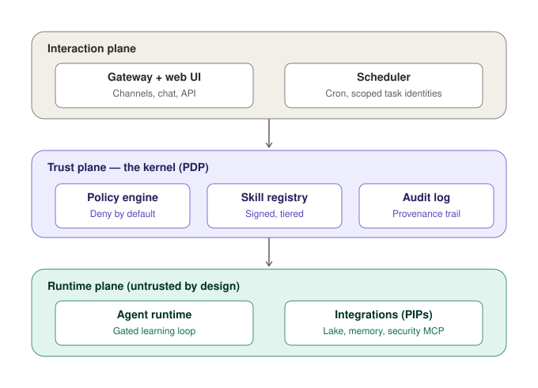
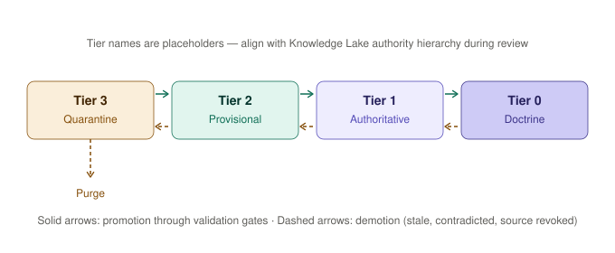
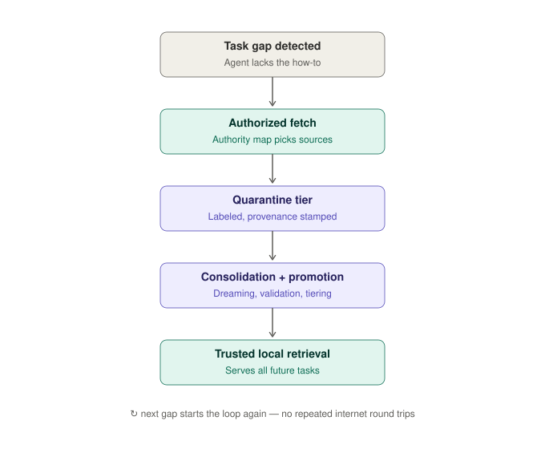

# Maknae Knowledge Lifecycle Contract (KLC)

| | |
|---|---|
| **Version** | 0.3 |
| **Status** | Accepted — operator-ratified 2026-08-30 |
| **Date** | 2026-08-30 (v0.1–0.2: 2026-07-14) |
| **Scope** | Maknae agent platform — trust plane knowledge governance |
| **Audience** | Human reviewers and AI agents (dual-audience document) |

---

## 1. Purpose

This contract defines how knowledge enters, lives in, and leaves the Maknae agent platform. It governs three knowledge types — documents, skills, and memories — under a single authority-tiered, provenance-stamped, deny-by-default lifecycle enforced by the trust plane kernel.

The contract exists because Maknae's agent runtime is permitted to **learn**: it may generate skills from experience (Hermes-style learning loop) and ingest documents into its local Knowledge Lake when tasked work reveals a knowledge gap. Self-directed learning without governance is configuration drift by design. This document is the governance.

This is a specification, not an implementation guide. Anything not explicitly permitted by this contract is denied.

## 2. Design doctrine

Four axioms apply to every requirement in this document. They are not configurable.

1. **Secure by Design and by Default.** Security properties are structural, not optional settings. There is no "permissive mode."
2. **Data Centric Security (DCS).** Security metadata travels *with* the data as labels, not around it as perimeter configuration. Every knowledge object carries its labels for its entire life, and policy binds to those labels rather than to where the object happens to sit. That much is structural and holds in every deployment.

   > **Corrected 2026-08-30 (v0.3) per [ADR-0020](adr/ADR-0020-access-control-model-and-vocabulary.md) and [ADR-0004](adr/ADR-0004-modular-authorization-architecture.md).** v0.2 continued: *"DCS here is an MLS conversation from birth: labels are points in the deployment's classification lattice (§6), and every DCS decision … is a dominance decision over that lattice."* That describes one configuration as though it were the platform. The in-repo default **decision model is RBAC** (`maknae-authz-basic`); an attribute-keyed model — clearance, classification, releasability, compartments, need-to-know — is an **optional backend behind the `maknae-security` seam**, present only where a deployment installs one. Under this repository's own currency guard the code is authoritative, and the code has no lattice. *(Corrected 2026-09-06, #148/#154: the in-repo default composition now also carries a MANDATORY classification-ceiling operand — content at or below `core.handling.ceiling`'s level flows, above it is refused, unmarked is UNCLASSIFIED; evaluated on every content request, never a grant. The attribute-keyed SCALPEL — compartments, releasability, need-to-know, labeling above UNCLASSIFIED — remains the optional external backend; the CEILING over the four-level order ships in the kernel. When the lake becomes a memory-system component its content, being unmarked and license-governed, flows at every ceiling.)*
   >
   > So the axiom is the **labelling discipline**, which is non-configurable and universal. **Lattice dominance is what a deployment acquires when it adds an attribute backend** — not a property of the base platform. A homelab carries labels exactly as an enclave does; it simply has nothing to dominate over. Reading the v0.2 text as binding would make the shipped product non-conformant to its own contract, which is how a contract rots into decoration.
3. **Zero Trust.** Every access decision evaluates (subject identity, action, resource labels, context). No subject — including the agent runtime itself — is implicitly trusted. Retrieved content is treated as input from an untrusted principal until promoted.
4. **Deny by default.** The policy engine whitelists capabilities. Absence of a rule is a denial. This applies equally to actions (tool calls, egress) and to epistemics (what knowledge may influence what decisions).

## 3. Architecture context

The platform is organized into three planes. All knowledge lifecycle transitions defined in this contract are enforced at the trust plane; the runtime plane cannot perform a transition, only request one.

> **Target shape, not current state (noted 2026-08-30, v0.3).** Two of the three planes exist. The trust plane is real — `maknaed` is the sole PDP and decides every request — and a local client speaks to it. The **interaction plane is unbuilt** (the gateway is issue #117), and the runtime plane's containers are Proposed. The rule above is nonetheless the binding one: it constrains what may be built, and nothing in the shipped code violates it. See `design/diagrams/generated-system-interfaces.svg` for which interfaces exist today and `design/diagrams/generated-container-architecture.svg` for the container view.



Roles map cleanly onto the standard access-control vocabulary ([ADR-0020](adr/ADR-0020-access-control-model-and-vocabulary.md)): the reference monitor is the **PDP**, integrations (the Lake, the memory subsystem, tool servers) are **PIPs**, and the skill registry plus authority map carry the policy the PDP evaluates. *(Provenance, never authority: the operator's Knowledge Lake brain/organ/soul model informed this shape. In-housed 2026-08-30, v0.3, per #34 — v0.2 said Maknae "is the executable implementation of the Lake's model", which made another project's design the authority for Maknae's architecture.)*

## 4. Knowledge types

| Type | Nature | Examples | Storage | Executable |
|---|---|---|---|---|
| **Document** | Declarative — what is true, what is official | Vendor docs, STIG guidance, runbooks, ingested references | Knowledge Lake (markdown, YAML frontmatter) | No |
| **Skill** | Procedural — how to do a thing | Generated task procedures, tool wrappers, playbooks | Skill registry (signed manifests) | Yes — execution is a privileged act |
| **Memory** | Episodic and semantic — what happened, what was learned about the operator and environment | Session records, consolidated preferences, environment facts | Memory subsystem (operator-owned store, LLM-efficient read path) | No |

All three types share the same label schema (§6), the same tier state machine (§5), and the same promotion pipeline (§8–9). They differ only in promotion criteria and in the privileges each tier grants.

## 5. Authority tiers

> **Resolved (2026-07-14, operator):** these lifecycle tiers are orthogonal to the Knowledge Lake's authority model, not a renaming of it. Lifecycle tiers answer "how far through the trust lifecycle is this object"; the Lake's domains/bands/natures answer "who outranks whom about what." Alignment is the derivation contract in §7.2 (authority basis → `tier_ceiling`), not shared vocabulary. Numeric lifecycle tiers stay.



| Tier | Name | Meaning | Who can place content here |
|---|---|---|---|
| **0** | Doctrine | Sealed, operator-signed truth. Constitution-level content: this contract, the authority map, core skills. | Operator signature only. Never automated. |
| **1** | Authoritative | Validated official knowledge. The "official way to do things." | Promotion pipeline with corroboration or operator sign-off (§9). |
| **2** | Provisional | Useful but unproven. May inform work; may not authorize privileged action. | Consolidation ("dreaming") cycle. |
| **3** | Quarantine | Freshly ingested, self-generated, or demoted content. Actively constrained (§10). | Any authorized ingest. All new knowledge starts here. |

Transitions are unidirectional steps: promotion moves exactly one tier per validation gate; demotion may move one or more tiers or purge. There is no path from Tier 3 directly to Tier 0.

## 6. Label schema

Every knowledge object carries YAML frontmatter. Required keys are enforced at ingest — an object missing required labels is rejected, not defaulted.

```yaml
---
klc: 0.2                       # contract version this object conforms to
id: doc-2026-0714-a3f9         # stable unique id
type: document                 # document | skill | memory
tier: 3                        # current lifecycle tier (integer)
tier_ceiling: 1                # max tier this object may ever reach — derived: ceiling projection over (band, nature), §7.2
classification: unclass        # DCS sensitivity label — a point in the deployment-declared lattice (§6 notes)
handling: []                   # caveats, e.g. [no-egress, operator-only]
provenance:
  source: https://access.redhat.com/documentation/...
  issuer: redhat               # bound by the egress rule that admitted the fetch (§7.1)
  issuance_type: product-doc   # authored at ingest
  nature: standard             # derived: (issuer, issuance_type) -> nature per the basis (§7.2)
  domain: vendor-official      # derived from the issuer registry
  band: peer                   # derived from the domain
  fetched: 2026-07-14T09:12:00+09:00
  sha256: <content hash at fetch time>
  fetch_task: task-2026-0714-runbook-kvm   # learning lineage: which task caused ingestion
lineage: []                    # for derived objects: list of input ids (see §11.1)
freshness:
  revalidate_after: P90D       # ISO 8601 duration; source re-checked by dreaming cycle
  last_validated: 2026-07-14T09:12:00+09:00
signatures: []                 # operator/CI detached sigs; required for tier <= 1 (§6.1)
---
```

Notes:

- `tier_ceiling` and the derived provenance fields (`nature`, `domain`, `band`) come from the authority basis (§7.2) under its derived-only lock — stamped at ingest, gate-verified, never author-supplied — and automation can never raise a ceiling. A community blog post with ceiling 2 stays ceiling 2 no matter how useful it proves.
- `handling` labels are enforced by the policy engine at every read: e.g. `no-egress` content can never appear in an outbound request body.
- Skills additionally carry an execution manifest (declared capabilities, sandbox requirements). Skill signing is mandatory at Tier 1 and above; unsigned skills cannot execute regardless of tier.
- Memories additionally carry `subject` scoping (which persona/operator the memory concerns) so cross-persona leakage is a policy decision, not an accident.
- **Operators are the security subjects; personas are presentation.** Every interaction resolves to an authenticated operator (caller) carrying an operator-owner-assigned attribute set — e.g., level, communities/releasability, role — and every hook decision evaluates resource labels against those attributes, ABAC-style. One agent instance serves multiple operators with different entitlements: retrieval (hook B), skill execution (hook F), and outputs (hook E) are all filtered per subject. Autonomous work follows the same model — scheduler and dreaming tasks run under scoped task identities, which are just subjects with (narrow) attribute sets. **Recurring task definitions carry DCS labels at creation, bounded by the creating operator's attributes** — no escalation via scheduling — and endpoint eligibility is re-evaluated at fire time against current registrations and attributes, failing closed on drift. Unattended work can never route to a model its labels do not permit; data sovereignty holds when nobody is watching. Prior art: the Security MCP server's four-dimensional ABAC gate; sibling effort: knowledgebase #284 (identity-aware DCS retrieval filtering).
- **Classification labels form a lattice with full Bell-LaPadula enforcement.** The deployment declares its classification vocabulary as an ordered lattice: levels plus category sets (compartments, multinational releasability, e.g., REL AUS,KOR). The kernel enforces dominance: **no read up** (hook B — a subject retrieves only objects whose classification its clearance and categories dominate) and **no write down** (hooks C/E — a derived object classifies at the **high-water mark** of its inputs, and a task context assumes the high-water mark of everything retrieved into it; its outputs inherit that mark). Downgrade/sanitization is a signed act by an authorized subject — never automated. This is the mirror of §11.1: authority ceilings take the min of inputs, classification takes the max, and automation crosses neither line. A single-level deployment (e.g., a homelab) declares a trivial lattice and BLP degenerates to a no-op — the structure ships from birth, the ceremony appears only when the lattice is real. The lattice pairs with a **per-instance classification ceiling**: the deployment's identity config declares the maximum label the instance is accredited to hold (level, releasability set, CUI categories, with an accreditation reference), and hook A refuses ingest of any object whose label exceeds it — a dominance check in every dimension. This is knowledgebase #280's two-level model (enclave ceiling + per-document `dcs_label`), which Maknae's lake inherits by construction as a portable lake instance — same schema, not a parallel invention.
- **Model endpoints are labeled resources — and the label is a full MLS lattice point.** Every registered LLM endpoint carries operator-signed DCS labels: its accredited classification level and releasability categories (a point in the deployment lattice), plus jurisdiction/nationality, sanctioning authority, and handling ceiling. Hook E requires the endpoint's accredited label to **dominate the payload's high-water mark** — a SECRET//REL AUS,KOR task context can only be served by an endpoint accredited at or above that point. The driver model for any request is itself a DCS decision at hook E: subject attributes × endpoint labels × payload labels — e.g., an AUS operator routes only to AUS-native registered models, a KOR operator to NAVER/Kakao, a US DoD operator to DoD-sanctioned endpoints. **Roles grant administrative actions; they never widen data or endpoint access beyond the subject's attributes** (the Security MCP's "I'm an admin, but it doesn't matter" model).

### 6.1 The kernel is the integrity root for label state, at every tier

**Decided 2026-08-30 (v0.3), closing [#2](https://github.com/darkhonor/maknae/issues/2).**

Operator detached signatures are required at tier ≤ 1 and that does not change. But signatures alone left tiers 3 and 2 with **no integrity mechanism at all**, while the frontmatter that carries `tier` *is itself* the tier state — so a runtime-plane edit of `tier: 3` to `tier: 2` transits no hook, raises no audit event, and has no signature to fail. That defeats §3 ("the runtime plane cannot perform a transition, only request one"), the §11 guardrails, and the `every_transition: audited` invariant simultaneously.

**The kernel is the integrity root for all label, tier and classification state, at every tier.** It maintains a kernel-held integrity index over each object's label state — stamped at every hook A/C/D transition and verified at every hook B/C/D read — so a frontmatter edit made outside the kernel is **detected as forgery** rather than honoured. The mechanism (kernel-held hash ledger vs. kernel-applied MAC over frontmatter) is an implementation choice; the property is not.

Derivation inputs bind to the signed authority map, never to runtime-supplied values: `issuance_type` is as authority-bearing as `issuer` (§7.2), and both are derived-only.

**Corollary for deployment.** No untrusted container may hold write access to the corpus that carries label state. Writes are brokered through a kernel API, or the mount is not `rw`. `design/container-architecture.md` §4 is corrected to match in the same change.

**Status: decided, unbuilt.** There is no Knowledge Lake in the tree yet, so this constrains what gets built rather than describing what runs.

## 7. Authority map

The authority map is the agent's epistemic policy. It is a Tier 0 artifact, versioned in git and portable with the Lake, authored by the operator during onboarding — a CLI wizard or the web UI, in the same spirit as OpenClaw's and Hermes' onboarding flows — and changed only by operator-signed commits thereafter. Operator-configurable never means runtime-mutable.

The map separates two concerns the v0.1 draft conflated. **The separation, and every rule in §7.1 and §7.2, is a Maknae decision made here.** *(Provenance, never authority, per the [ADR README doctrine](adr/README.md#authority-rule-external-adrs-are-not-authoritative-here): the operator's Knowledge Lake work — `mpe-es/knowledgebase` ADR-0004 and its #201 build-out, that project's numbering and not Maknae's — informed this design. In-housed 2026-08-30, v0.3, per issue #34: v0.2 opened this section with "Following the Knowledge Lake's authority-line model", which rested a Maknae rule on another project's document. The rules did not change; the authority for them is now stated correctly.)*

### 7.1 Egress allowlist — where the agent may learn from

The kernel's fetch-permission table, enforced at hooks A and E. A fetch to any URL not matched by an `allow` pattern is denied and logged as a learning request; the runtime does not decide where to learn from, the map does. Each allow pattern binds the content it admits to an issuer in the authority basis (§7.2).

### 7.2 Authority basis — how much to trust what came back

The basis is a **schema, not a fixed hierarchy**:

- **Domains with bands.** Operator-defined knowledge domains, each in one of three bands: `supra` (binds everything), `peer` (no intrinsic precedence between peers), `non-authoritative` (informs, never controls). Authority is a peer DAG, not a ladder.
- **Issuer registry (derived-only lock).** The single source from which every authority property derives: (issuer, issuance type) → nature. Authority fields are never author-supplied per object.
- **Natures gate officialness.** A source's issuance nature (directive, standard, guidance, doctrine, guide, blog, ...) determines whether its content can ever become "the official way" — and distinct controlling natures stack, they do not compete.
- **Ceiling projection.** `tier_ceiling` = projection(band, nature), operator-tunable per deployment. Automation may never raise a ceiling (§15).
- **Typed precedence edges.** Precedence between sources lives in exactly one representation: authored, typed edges. It is never inferred from tier numbers, fetch order, publication date, or lexical sort. Cross-peer conflicts with no connecting edge surface to the operator.

**Portability rule: no baked-in hierarchy.** Maknae ships no default authority content. The federal/DoD hierarchy (SUPRA, the dod/nist/cnss peer domains, DISA/NIST issuers) is packaged as a **sample profile** — the "easy mode" onboarding choice and the worked example in the documentation — alongside deliberately non-governmental samples (e.g., a homelab profile). A deployment's authority content is the operator's statement about their world, not the platform's.

```yaml
# authority-map.yaml  (Tier 0 — operator signed)
klc: 0.2
egress:
  default: deny                        # explicit; unmatched fetch is denied + logged
  allow:
    - match: "rhel/**"                 # knowledge domain the fetch serves
      pattern: "https://access.redhat.com/**"
      issuer: redhat
    - match: "rhel/**"
      pattern: "https://sysadmin-notes.example.net/**"
      issuer: community-blogs
basis:
  domains:
    - {id: vendor-official, band: peer}
    - {id: community, band: non-authoritative}
  issuers:                             # derived-only lock: the single derivation source
    - key: redhat
      domain: vendor-official
      issuance_types:
        - {code: product-doc, nature: standard}
        - {code: kb-article, nature: guidance}
        - {code: blog, nature: blog}
    - key: community-blogs
      domain: community
      issuance_types:
        - {code: blog, nature: blog}
  ceiling_projection:                  # (band, nature) -> tier_ceiling; operator-tunable
    - {band: supra, ceiling: 1}
    - {band: peer, natures: [directive, standard, guidance], ceiling: 1}
    - {band: peer, natures: [doctrine, guide, admin], ceiling: 2}
    - {band: non-authoritative, ceiling: 2}   # may inform, never becomes official
    - {default: 3}                            # unknown -> quarantine ceiling
```

Rules:

- A fetch to any URL not matched by an `allow` pattern is denied by the kernel.
- Everything ingested through an allow pattern gets its authority properties (domain, band, nature) derived from the issuer registry and its `tier_ceiling` from the projection — stamped at ingest, gate-verified, never author-supplied.
- Map changes are operator-signed commits, whether authored by hand, the CLI wizard, or the web UI. The dreaming cycle may *propose* map additions (as Tier 3 change requests); it may never apply them.

## 8. Lifecycle protocol



1. **Gap detection.** During a task, the runtime determines it lacks required knowledge (retrieval from the Lake returns nothing above the task's minimum tier). The gap is logged with the task id.
2. **Authorized fetch.** The runtime requests a fetch. The kernel evaluates the request against the authority map. Denied fetches are logged as learning requests for operator review; on air-gapped or degraded hosts this is the *only* outcome (§12).
3. **Quarantine ingest.** Fetched content is normalized to Lake format, labeled per §6 (tier 3, ceiling and authority fields derived per §7.2, provenance and hash stamped), and stored. Quarantined content is immediately usable *within the constraints of §10* — it may inform the current task's reasoning but not privileged actions.
4. **Consolidation ("dreaming").** An out-of-band, scheduled process — never the in-band task — reviews quarantined content: deduplicates, validates against source, checks corroboration, distills memories, refines candidate skills. Consolidation runs under its own scoped identity with no interactive privileges.
5. **Promotion.** Objects meeting the criteria in §9 move up exactly one tier. Promotions to Tier 1 require signatures. All transitions are audit events with before/after labels.
6. **Retrieval.** Future tasks retrieve locally, filtered by tier and labels. The loop closes: no repeated round trips to the Internet for knowledge the agent already validated.

## 9. Promotion and demotion criteria

### 9.1 Promotion (per type)

| Gate | Document | Skill | Memory |
|---|---|---|---|
| **3 → 2** | Source hash verified; content parsed clean; no handling conflicts; dedup complete | Generated in sandbox; manifest declares capabilities; static checks pass; dry-run in sandbox succeeds | Consolidation distilled from ≥1 session; no sensitive-label conflicts |
| **2 → 1** | Corroborated by a second independent ceiling-1 source (independence definition: §14 Q8) **or** operator sign-off; within `tier_ceiling` | Passed N successful supervised executions with zero policy denials; capability set minimal (least privilege review); **signed** | Confirmed across ≥3 independent sessions **or** operator confirmation; **signed** |
| **1 → 0** | Operator signature only. Automation may propose, never apply | Same | Same (rare; e.g. standing operator directives) |

`N` for skills is a tunable per capability class — a read-only skill might need 3 supervised runs; a skill that writes to infrastructure might need 10 plus explicit operator approval. **Open question for review (§14).**

### 9.2 Demotion and purge

Demotion is automatic and is a feature, not a failure:

- **Stale:** `revalidate_after` elapsed and source re-check fails or content drifted (hash mismatch) → demote one tier, flag for re-consolidation.
- **Contradicted:** a higher-authority source contradicts the content → demote below the contradicting source's tier.
- **Source revoked:** the authority map entry that admitted the object is removed or downgraded → object's `tier_ceiling` recomputed; demote to comply.
- **Policy violation at runtime:** a skill whose execution triggers a policy denial is demoted to quarantine pending review.
- **Purge:** quarantined content that fails validation, ages out, or is operator-rejected is deleted; the audit record of its existence and rejection is retained.

### 9.3 Internal-origin objects, and the gate that could not be passed

**Decided 2026-08-30 (v0.3), closing [#9](https://github.com/darkhonor/maknae/issues/9).**

v0.2 governed knowledge that arrives from **outside**. Memories and self-generated skills arrive from **inside**, and under deny-by-default they could not be written at all: they fit neither hook A (no external source) nor hook C (no input lineage), have no issuer and therefore no derivable `tier_ceiling`, and `min(inputs)` is undefined over an empty set. The learning loop — the platform's defining feature — was unreachable through its own contract.

**Synthetic issuers.** The registry (§7.2) carries operator-declared synthetic issuers for internal origination — `self:memory`, `self:skill` — each with a stated ceiling and nature, signed into the authority map like any other. Internal-origin objects derive their authority fields from these exactly as external objects do, so the derived-only lock (§15) holds without exception. Classification is the high-water mark of contributing sessions. Hook **C** mediates: origination is a derivation whose lineage is sessions rather than documents.

**The skill gate deadlock.** v0.2 required *N* successful supervised executions for 2 → 1, while hook F refused to execute anything below executable tier. **No skill could legally reach Tier 1.** Hook F therefore admits a **supervised-execution mode**: a Tier-2 skill carrying a kernel-issued *provisional* signature executes under operator supervision, in-sandbox, with every run audited and any policy denial ending the trial. Provisional signatures never satisfy hook F outside supervision, and never satisfy promotion by themselves.

**Session independence is evidentiary, not arithmetic.** "≥3 independent sessions" meant three sessions, so three reads of one poisoned page cleared the bar. Independence is now **disjoint source closures**: sessions whose evidentiary lineages share no source are independent; sessions that read the same page are one witness, counted once, however many times they ran.

**Contradiction-demotion is stated in basis terms.** v0.2 ranked precedence by tier number, which the `precedence_outside_typed_edges: never` invariant forbids — the rule violated the contract it sits in. Contradiction is resolved by **typed precedence edges** (§7.2); a cross-peer conflict with no connecting edge **surfaces to the operator** rather than being settled by arithmetic.

**`ceiling_projection` resolves deterministically.** Most specific match wins — nature before band, exact before wildcard — and ties are a **load-time error**, not a silent pick. An ambiguous projection table fails the boot, because a ceiling chosen by table order is a ceiling nobody decided.

**Status: decided, unbuilt.** No memory subsystem, no skill registry.

## 10. Policy enforcement hooks

The kernel enforces this contract at six checkpoints. Each is a deny-by-default decision over (subject, action, resource labels, context), producing an audit event.

| Hook | Transition / action | Enforced rules (minimum) |
|---|---|---|
| **A. Ingest** | External content → Tier 3 | Source matched by authority map; required labels present; ceiling stamped; hash recorded; object's classification label within the instance ceiling (dominance check, §6) |
| **B. Retrieve** | Knowledge → runtime context | Task's minimum tier satisfied; classification and handling labels compatible with subject (dominance, §6); cross-persona memory access requires explicit rule; **filtering is non-disclosing** — content the subject cannot see never enters the context serving them, so the agent cannot play "I have a secret": for that subject, it genuinely has none |
| **C. Derive** | Runtime creates new object from existing ones | New object tier = 3; `tier_ceiling` = min(ceiling of all inputs); full input lineage recorded (§11.1) |
| **D. Promote / demote** | Tier change | Criteria of §9 met; one tier per gate; signature requirements; audit before/after |
| **E. Egress** | Any outbound data flow | Destination on authority map or task-scoped allowlist; payload contains no `no-egress` labeled content; Tier ≤ 1 content quoted outbound requires explicit rule; model-endpoint eligibility = subject attributes × endpoint labels × payload labels (§6) — administrative role never bypasses; **every authenticated recipient's attributes must dominate the reply's high-water mark (§10.1)** |
| **F. Execute** | Skill invocation | Skill signed and at executable tier (**or provisionally signed under supervised execution, §9.3**); declared capabilities ⊆ persona + task whitelist; sandbox strength of host ≥ skill's declared requirement; **context-integrity floor met (§10.2)** |

Hook F's host-sandbox condition makes portability a policy input: the same skill may be permitted on a hardened Linux node (namespaces, seccomp) and denied on a macOS host with weaker isolation primitives. Sandbox strength is a declared, attested host property.

### 10.1 The output interface is an MLS interface

**Decided 2026-08-30 (v0.3), closing [#7](https://github.com/darkhonor/maknae/issues/7).**

v0.2's hook E governed **destinations and model endpoints** and stopped there. Nothing required the *operator receiving a reply* to be cleared for it. §6 already said outputs inherit the context's high-water mark — so the principle was stated in one section and enforced in neither, which is the drift class this contract exists to prevent.

A reply is an outbound flow to a labelled recipient, and hook E treats it as one:

- **Per-recipient dominance.** Every authenticated recipient's clearance and categories must dominate the reply payload's high-water mark. A subject who could not have *retrieved* the content at hook B cannot receive it in a reply.
- **Shared channels.** A channel with more than one member is bound to a **floor label** — the greatest lower bound of its members' clearances — or the context is forked and answered per subject. There is no third option in which a high-context reply lands in a shared channel and the platform hopes.
- **Conformance vectors.** The multi-operator reply case is a required vector: same context, two recipients of differing clearance, and the assertion is that they receive different replies.

**Status: decided, unbuilt.** No gateway, no channels (#117).

### 10.2 Context integrity is an input to execution, not only to retrieval

**Decided 2026-08-30 (v0.3), closing [#8](https://github.com/darkhonor/maknae/issues/8).**

The quarantine rule — Tier-3 content may **inform** reasoning but not **authorize** privileged action — had no enforceable semantics. Hooks tracked classification taint but not epistemic-tier taint, so quarantined content could steer an action the subject was *already* authorized to take. That is the confused-deputy residual, and it is not a classification problem: the content is readable, and reading it is not the harm.

- **Sticky context taint.** A context records the minimum epistemic tier of everything retrieved into it, propagating exactly as the classification high-water mark does (§6) — the mirror rule, floor instead of ceiling.
- **Hook F takes it as an input.** A context carrying Tier-3 content meets a **reduced execution whitelist**: read-only and non-state-changing skills proceed; state-changing skills require operator approval while the taint stands.
- **One tier-gating model.** Per-action-class floors, not a single task-wide minimum. v0.2's "task's minimum tier" at hook B made quarantine-informs-current-task unfulfillable for precisely the learning-loop tasks that need it — the gate contradicted the lifecycle it was gating.
- **`no-egress` is a taint, not a string.** Content matching over runtime-composed payloads loses to paraphrase. The label propagates into the context; the check is on the context, not the wording.

**Status: decided, deferred.** Moot at MVP — the lake is consumer-only, so nothing self-generated enters. Re-validated when the constellation lands.

## 11. Anti-poisoning guardrails

An agent that feeds itself has failure modes a curated lake does not. These four rules are load-bearing.

### 11.1 No provenance laundering
Derived objects inherit `tier_ceiling = min(inputs)` and record full lineage. A summary of a Tier 2 blog post is Tier 3 content with a Tier 2 ceiling — it can never out-rank its weakest source. Lineage includes the triggering task id ("learning lineage") so any belief can be traced to the work that produced it.

### 11.2 Corroboration before authority
Nothing promotes to Tier 1 on the strength of a single sub-Tier-1 source. Either a second independent authorized source agrees, or a human signs. This closes the single-compromised-source poisoning path.

### 11.3 Freshness is a label
Every object carries `revalidate_after`. The dreaming cycle re-verifies against sources and demotes on drift. Stale doctrine is worse than no doctrine; demotion is the immune response.

### 11.4 The fetch is a privileged act
Learning fetches are agent-initiated network egress, gated by the kernel against the authority map (hooks A and E). The runtime's good behavior is never the control; the kernel is.

## 12. Degraded and air-gapped operation

When no authorized source is reachable (air-gapped host, network denial, degraded links):

- Gap detection still runs; gaps are logged as **learning requests** with domain, task lineage, and proposed sources for operator action.
- Sneakernet ingest follows the identical pipeline: imported bundles enter at Tier 3 with provenance pointing to the signed transfer manifest instead of a URL.
- Lake replication between sites uses the git-distributed model; labels and signatures travel with the content, and receiving sites re-verify signatures before honoring tiers. A tier claim without a valid signature degrades to quarantine on import, and every import re-runs the receiving instance's ceiling dominance check — content above the receiving enclave's declared ceiling refuses on import regardless of what the sending site was accredited to hold.

The maximal composition of this section with §6 is the north-star deployment: a classified, multinational, air-gapped enclave — many partner operators as attribute-bearing subjects, a full Bell-LaPadula lattice with releasability categories, and every model endpoint local and accredited. Nothing about that deployment is a special mode; it is the same kernel with a richer lattice and a stricter map.

## 13. Security control mapping (informative)

| Contract element | NIST SP 800-53 (rev 5) |
|---|---|
| Deny-by-default policy engine, capability whitelists | AC-3, AC-6, CM-7 |
| DCS labels bound to data, handling enforcement | AC-16, SC-16 |
| Bell-LaPadula dominance (no read up / no write down), automated-downgrade prohibition | AC-3(3), AC-4, AC-16(6) |
| Egress control via authority map | SC-7, AC-4 |
| Provenance, lineage, audit events at every transition | AU-2, AU-10, SR-4 |
| Skill signing, signature verification on import | SI-7, CM-14 |
| Freshness revalidation, demotion | SI-2 (concept), CM-3 |
| Scoped identities for scheduler and dreaming cycle | AC-5, IA-2 |

> **Superseded for currency 2026-08-30 (v0.3).** The table above stays as the contract's own statement of intent, but it is **not** the place to read Maknae's control posture from. `design/diagrams/generated-standards-profile.svg` (DoDAF StdV-1, rendered from `design/diagrams/standards-profile.toml`) carries the same claims with a **status per row** — separating what CI or the runtime mechanically refuses from what is merely implemented — and every row names evidence a reader can open. A table that cannot tell those apart overstates the system, which is the failure this contract warns about everywhere else. Where the two disagree, the profile is current.

Mappings here are informative; a full control matrix belongs in an RMF package, not in this contract.

## 14. Open questions for team review

> **Adjudicated 2026-08-30 (v0.3). Nothing here is left merely open.** A contract carrying nine unanswered questions while ranking second in the repository's currency guard is a contract that outranks its own uncertainty. Each is now closed, decided, or **explicitly deferred with the condition that reopens it** — a deferral naming its trigger is a decision; a deferral that does not is a wish.
>
> | # | Question | Disposition |
> |---|---|---|
> | 1 | Tier vocabulary | **Closed** 2026-07-14 — orthogonal axes; numeric lifecycle tiers stay |
> | 2 | Supervised-run counts *N* per capability class | **Deferred** — reopens when the skill registry exists. *N* is unknowable before there are skills to measure; §9.3's supervised-execution mode is the machinery it will tune |
> | 3 | Corroboration for sole-source domains | **Decided** — operator sign-off is the only 2 → 1 path. No sole-source exception, no tighter-freshness carve-out. Deny-by-default does not acquire an escape hatch because a domain is small |
> | 4 | Memory consolidation cadence | **Deferred** — reopens with the memory subsystem. Cadence is an operational tuning parameter, not a contract term |
> | 5 | Policy language selection | **Closed** 2026-08-22 — [ADR-0004](adr/ADR-0004-modular-authorization-architecture.md): no single language; a seam with pluggable backends |
> | 6 | Quarantine usability window | **Closed by §10.2** — the window was the wrong shape. Not "how long may Tier-3 inform", but "what may a tainted context *do*": per-action-class floors, sticky taint, operator approval for state-changing skills |
> | 7 | Cross-persona memory rules | **Closed** 2026-07-14 — MVP is single-persona; deny-by-default already answers it, and `subject` scoping ships in the schema |
> | 8 | Corroboration independence | **Decided by §9.3** — the bar is **disjoint source closures**, not domain diversity. Requiring a *different peer domain* punishes single-domain deployments for their topology while a shared source inside two domains would still pass; closure disjointness measures the thing that actually matters |
> | 9 | Generation pressure for the dreaming cycle | **Deferred** — reopens with the dreamer. Candidate-generative vs conservative is untestable without a promotion pipeline to filter against |
>
> The bullets below are the original text, retained for provenance. Where a bullet and the table disagree, the table is current.

1. **Tier vocabulary.** *Resolved 2026-07-14 (operator):* lifecycle tiers and Lake authority are orthogonal axes; numeric lifecycle tiers stay, and alignment is the §7.2 derivation contract (lake authority basis → `tier_ceiling`), not shared vocabulary.
2. **Supervised-run counts (N) per capability class** for skill promotion (§9.1) — propose initial values.
3. **Corroboration for niche domains** where only one authoritative source exists (e.g., a vendor's sole KB) — is operator sign-off the only 2→1 path, or do we define a "sole-source" exception with tighter freshness?
4. **Memory consolidation cadence** — nightly dreaming vs. event-driven, and interaction with operator's existing memory subsystem consolidation.
5. **Policy language selection** for the kernel. *Resolved 2026-08-22 ([ADR-0004](adr/ADR-0004-modular-authorization-architecture.md), superseding ADR-0003): there is no single policy language to select. Authorization is a policy-agnostic `maknae-security` seam with pluggable `maknae-authz-*` backends — a native-Rust RBAC default (`maknae-authz-basic`), classification via an optional attribute-keyed backend *(plus, since 2026-09-06 (#148/#154), an in-repo mandatory ceiling operand — at or below the declared level flows — that is always composed)*, and Cedar or others as optional backends where a deployment justifies one. The hook table (§10) is enforced by the composed backends, not a single engine.*
6. **Quarantine usability window** — how long may Tier 3 content inform in-band reasoning before consolidation must adjudicate it?
7. **Cross-persona memory rules** — default deny with explicit share grants, or persona-group scoping? ("Cross-persona": one platform instance hosting multiple personas, where persona B retrieves a memory formed under persona A — the sharp edge is audience mismatch, e.g., a private-DM-formed memory surfacing through a persona fronting a shared channel.) *Rescoped 2026-07-14 (operator): MVP is single-persona per instance; multi-persona arrives later behind a feature gate. Deny-by-default already answers the MVP case — no rule means no cross-access — and `subject` scoping ships in the schema from birth (§6), so enablement is additive. The grants-vs-groups decision is made when multi-persona lands, not at MVP. Refinement (operator, same date): the operative near-term requirement behind this question is **multi-operator DCS filtering of the single agent** — operators as attribute-bearing security subjects (§6) — not multiple agent personas; multiple agents per box is the later extension.*
8. **Corroboration independence.** Under the peer-domain basis (§7.2), does "second independent source" (§9.1, §11.2) require a *different peer domain* — e.g., a DISA STIG corroborated by a NIST publication rather than by another DoD document? Stronger guarantee, but harsher on single-domain deployments. *Operator: undecided as of 2026-07-14.* Interacts with #3 (sole-source domains).
9. **Generation pressure for the dreaming cycle.** Hermes' background review is deliberately aggressive ("a pass that does nothing is a missed learning opportunity"); Maknae's consolidation is out-of-band and gated. Should the cycle be candidate-generative with the promotion pipeline as the filter, or conservative with a high bar to even draft? Interacts with #6 (quarantine usability window).

## 15. Machine-readable invariants

For AI agents operating on this repository: the following invariants MUST hold in any implementation and MAY be used as acceptance criteria.

```yaml
klc_invariants:
  - all_new_knowledge_enters_at_tier: 3
  - promotion_step_size_max: 1
  - tier_ceiling_raised_by_automation: never
  - derived_ceiling: min_of_inputs
  - tier_0_writes: operator_signature_only
  - unsigned_skill_execution: deny
  - fetch_outside_authority_map: deny
  - no_egress_label_outbound: deny
  - missing_required_labels_at_ingest: reject
  - object_authority_fields: derived_only      # nature/domain/band/ceiling from the basis, never author-supplied
  - precedence_outside_typed_edges: never
  - derived_classification: high_water_mark_of_inputs
  - classification_downgrade_by_automation: never
  - every_transition: audited
  # added in v0.3 — the decisions in 6.1, 9.3, 10.1 and 10.2, stated as testable invariants
  - label_state_integrity_root: kernel          # at EVERY tier, not only tier <= 1 (6.1)
  - untrusted_write_to_label_state: deny        # brokered through the kernel, or not rw (6.1)
  - internal_origin_authority: synthetic_registry_issuer_only   # never self-asserted (9.3)
  - provisional_signature_outside_supervision: deny             # (9.3)
  - session_independence: disjoint_source_closures              # not session count (9.3)
  - precedence_by_tier_number: never            # typed edges only; restates the rule 9.2 broke
  - ambiguous_ceiling_projection: load_error    # never resolved by table order (9.3)
  - reply_recipient_dominance: required         # per authenticated recipient (10.1)
  - shared_channel_label: floor_of_members      # or fork per subject (10.1)
  - context_epistemic_taint: sticky_floor       # mirrors the classification ceiling (10.2)
  - state_changing_skill_under_taint: operator_approval          # (10.2)
```

## 16. Revision history

| Version | Date | Change |
|---|---|---|
| 0.1 | 2026-07-14 | Initial draft for team RFC |
| 0.3 | 2026-08-30 | **Ratified** (RFC → Accepted). Axiom 2 corrected to ADR-0020/ADR-0004 — the labelling discipline is universal, lattice dominance arrives with an optional attribute backend (v0.2 described one configuration as the platform). §3 marked target-shape. **§6.1** kernel as integrity root for label state at every tier (#2). **§9.3** internal-origin objects via synthetic issuers, supervised-execution mode resolving the skill gate deadlock, evidentiary session independence, contradiction-demotion restated in basis terms, deterministic ceiling projection (#9). **§10.1** output interface is an MLS interface — per-recipient dominance, shared-channel floor (#7). **§10.2** context-integrity taint as a hook-F input (#8). §13 superseded for currency by the StdV-1 profile. §14's nine questions all adjudicated — closed, decided, or deferred with a named trigger. §15 gained eleven invariants for the new decisions. §7 authority-line model in-housed as a Maknae decision, external citation downgraded to provenance (#34) |
| 0.2 | 2026-07-14 | Authority model reworked to the Knowledge Lake ADR-0004 authority-line basis (mpe-es/knowledgebase #201 and children): §7 split into egress allowlist + authority basis (domains/bands, derived-only issuer registry, natures, ceiling projection, typed precedence edges); §6 provenance fields derived, `source_authority` retired; portability rule — no baked-in hierarchy, USG ships as a sample profile; onboarding via CLI wizard or web UI; open question 1 resolved (orthogonal axes), questions 8–9 added; invariants extended (derived-only authority fields, typed-edge-only precedence) |
