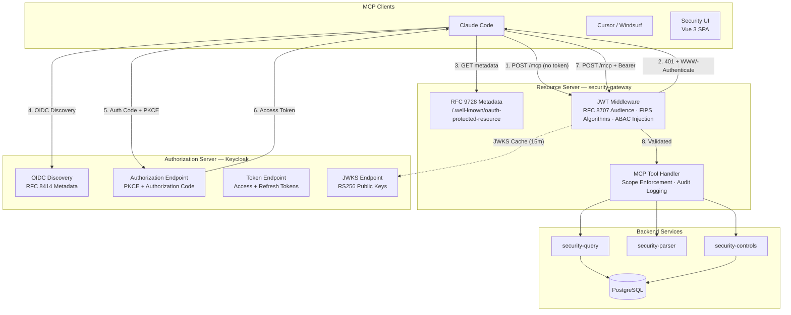
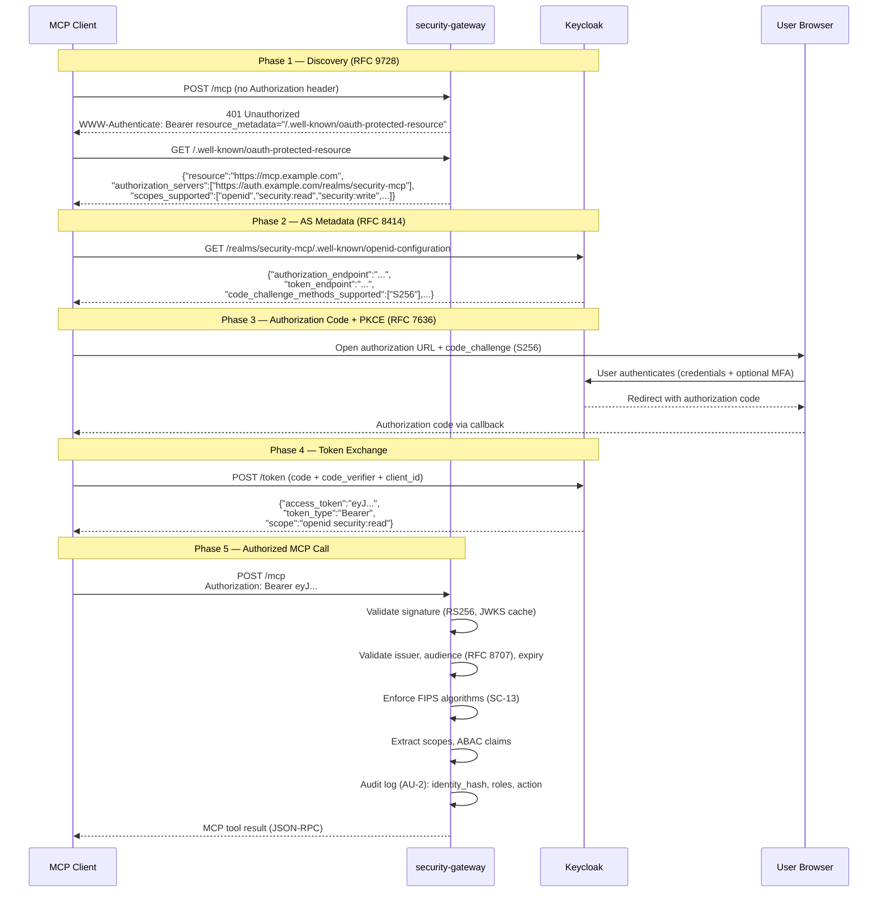
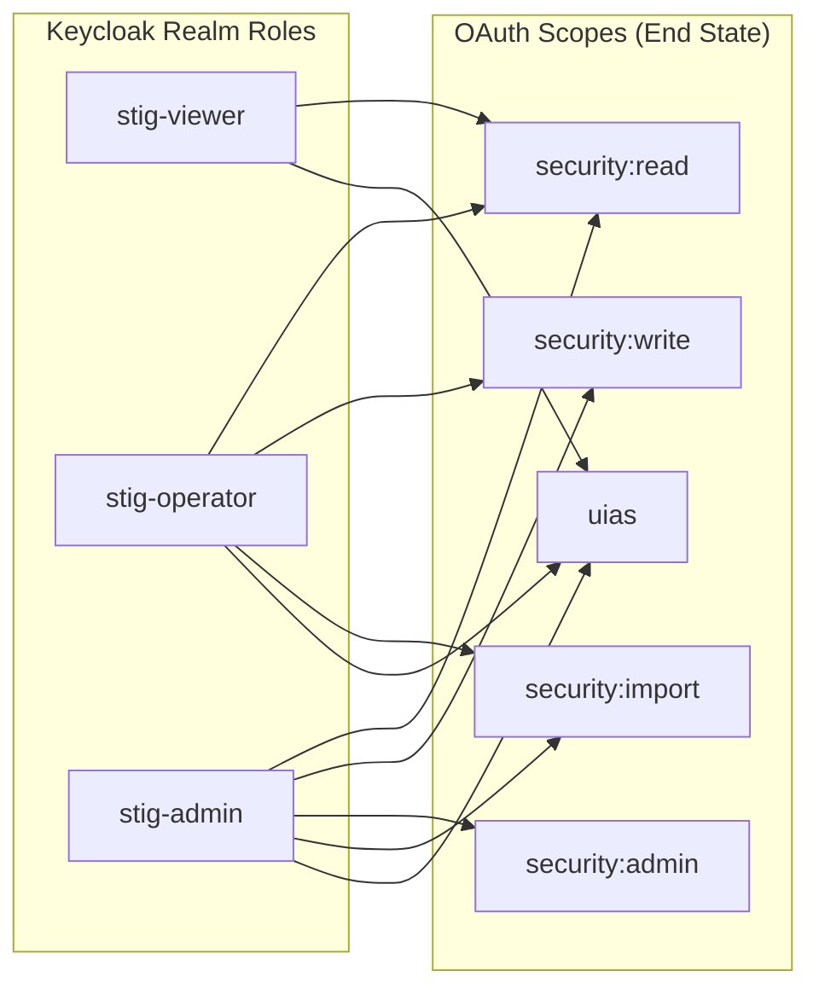

> **IMPORTED COMPANION REFERENCE (2026-07-15).** Copied verbatim from the
> operator's Security MCP Server repository
> (`docs/security/OAUTH-COMPLIANCE.md`,
> https://gitlab.com/homelab-systems/security-mcp-server) as the supporting
> reference for [`../abac-dcs-architecture.md`](../abac-dcs-architecture.md)
> section 5 (identity architecture) — the full 13-RFC OAuth 2.1 compliance
> matrix Maknae inherits, with per-RFC requirements, implementation evidence,
> and NIST control mappings. Evidence paths and internal links resolve only
> in the origin repository. Treat this file as a read-only snapshot — the
> origin repository owns the living document. Whether this companion remains
> in-repo before Maknae goes public is an open decision recorded in
> abac-dcs-architecture.md section 14.

<!--
  Filename: OAUTH-COMPLIANCE.md
  Last Modified: 2026-02-21
  Summary: OAuth 2.1 protocol compliance assessment for Security MCP Server
  Compliant With: DoD STIG, NIST SP800-53 Rev 5, FIPS 140-3, MCP Authorization Spec
  Classification: UNCLASSIFIED
-->

# OAuth 2.1 Protocol Compliance Assessment

**System:** Security MCP Server
**Version:** v0.9.0 (Epic #138 complete)
**Date:** 2026-02-21
**Author:** Alex Ackerman
**Security Contact:** <security@securitymcp.io>
**Classification:** UNCLASSIFIED

---

## 1. Executive Summary

Security MCP Server implements an OAuth 2.1 authorization architecture to protect
Model Context Protocol (MCP) tool invocations. The system separates concerns between
a **Resource Server** (security-gateway, Go with FIPS BoringCrypto) and an
**Authorization Server** (Keycloak 26.x). All tokens are cryptographically bound to
the resource URL per **RFC 8707**, and MCP clients discover the authorization server
automatically via **RFC 9728** protected resource metadata.

| Metric | Value |
|--------|-------|
| **Authorization Framework** | OAuth 2.1 (`draft-ietf-oauth-v2-1`) |
| **Authorization Server** | Keycloak 26.x (Red Hat SSO lineage) |
| **Resource Server** | security-gateway (Go 1.25, FIPS BoringCrypto) |
| **MCP Spec Versions** | 2025-06-18 (baseline), 2025-11-25 (target) |
| **RFCs Fully Implemented** | 13 of 13 MCP-required RFCs |
| **RFCs Planned** | 0 remaining — all MCP-required RFCs implemented |
| **NIST Controls Addressed** | IA-2, IA-5, IA-5(1), IA-8, AC-2, AC-2(3), AC-3, AC-4, AC-6, AC-7, AC-8, AC-12, AC-16, AU-2, AU-3, AU-10, CM-2, CM-3, PT-2, SA-4, SC-5, SC-7, SC-8, SC-13, SC-23, SI-4 |
| **FIPS 140-3 Validation** | CMVP Certificate #4282 (OpenSSL), BoringCrypto (Go) |
| **Test Coverage** | 95+ OAuth/JWT-specific test functions across 6 test suites (170+ cases with sub-tests) |

### Compliance Readiness

```text
Fully Implemented:  ████████████████████████  100%  (13 of 13 RFCs)
```

---

## 2. System Architecture

The authorization architecture follows a standard OAuth 2.1 three-party model where
the **MCP Client** (Claude Code, Cursor, or any MCP-compatible tool) authenticates
with the **Authorization Server** (Keycloak) and presents bearer tokens to the
**Resource Server** (security-gateway). The gateway validates tokens locally using
cached JWKS key material — no runtime dependency on Keycloak for request processing.



### Authorization Flow

The following sequence diagram shows the complete token acquisition and validation
flow for an MCP client connecting to Security MCP for the first time.



---

## 3. RFC Compliance Matrix

Each subsection covers one IETF RFC required or recommended by the MCP Authorization
specification. For each RFC, the table identifies **who implements it** (Keycloak or
Gateway), the **current status**, and the **NIST controls** it satisfies.

### 3.1 RFC 6749 — OAuth 2.0 Authorization Framework

| Field | Value |
|-------|-------|
| **MCP Spec Requirement** | MUST (foundation) |
| **Implemented By** | Keycloak (AS), security-gateway (RS) |
| **Status** | **Implemented** |
| **NIST Controls** | IA-2, IA-8, AC-3 |

Keycloak implements the full OAuth 2.0 authorization framework as the Authorization
Server. The gateway acts as the Resource Server, validating bearer tokens and enforcing
scope-based access control. Per OAuth 2.1, the **implicit grant** and **resource owner
password credentials grant** are both **prohibited** and disabled in all client
configurations (`implicit_flow_enabled = false`, `direct_access_grants_enabled = false`).

| Evidence | Path |
|----------|------|
| Client definitions (IaC) | `terraform/keycloak/clients.tf` |
| Scope enforcement | `containers/security-gateway/internal/middleware/jwt.go` |

---

### 3.2 RFC 6750 — OAuth 2.0 Bearer Token Usage

| Field | Value |
|-------|-------|
| **MCP Spec Requirement** | MUST |
| **Implemented By** | security-gateway (RS) |
| **Status** | **Implemented** (Story #142, deployed 2026-02-21) |
| **NIST Controls** | IA-5, AC-3, SC-8 |

Bearer tokens are transmitted exclusively via the `Authorization: Bearer <token>` HTTP
header. The gateway **rejects** tokens sent via query parameters or form-encoded body
per RFC 6750 Section 2.3 security considerations. All 401 responses include a
`WWW-Authenticate` header with the `resource_metadata` parameter (RFC 9728) or a
`realm` fallback.

Per RFC 6750 Section 3, when a valid token lacks a required scope, the `WWW-Authenticate`
header includes the `scope` parameter indicating the required scope (e.g.,
`scope="stig:read"`). This enables MCP clients to programmatically determine which
scope to request during token refresh.

| Evidence | Path |
|----------|------|
| Bearer extraction | `containers/security-gateway/internal/middleware/jwt.go:244–262` |
| WWW-Authenticate header | `containers/security-gateway/internal/middleware/jwt.go:276–290` |
| Scope in challenge header | `containers/security-gateway/internal/middleware/jwt.go` (scope enforcement) |
| Tests | `containers/security-gateway/internal/middleware/jwt_test.go` |

---

### 3.3 RFC 7636 — Proof Key for Code Exchange (PKCE)

| Field | Value |
|-------|-------|
| **MCP Spec Requirement** | MUST |
| **Implemented By** | Keycloak (AS enforcement) |
| **Status** | **Implemented** |
| **NIST Controls** | SC-23, IA-5 |

All three Keycloak clients enforce **S256 PKCE** (`pkce_code_challenge_method = "S256"`).
Plain code challenges are rejected. This protects both public clients (security-ui,
mcp-http-client) and the confidential client (security-gateway) against authorization
code interception attacks.

**PKCE Discovery Validation (Story #143):** The gateway validates PKCE support in
two locations as defense-in-depth:

1. **Startup:** Fetches the AS OIDC discovery metadata and verifies
   `code_challenge_methods_supported` includes `S256`. Logs INFO on success, WARN on
   failure. Non-blocking — the gateway continues serving regardless.
2. **Admin health panel:** The `/api/v1/health/services` endpoint includes
   `pkce_supported` and `code_challenge_methods` in the Keycloak service details,
   giving administrators continuous visibility into AS PKCE compliance.

Both paths use the shared `oauth.FetchASMetadata` / `oauth.ValidatePKCESupport`
functions (single source of truth).

| Evidence | Path |
|----------|------|
| PKCE enforcement (all clients) | `terraform/keycloak/clients.tf:51,95,141` |
| OIDC discovery response | Keycloak built-in (`/.well-known/openid-configuration`) |
| PKCE discovery module | `containers/security-gateway/internal/oauth/discovery.go` |
| PKCE discovery tests (13 cases) | `containers/security-gateway/internal/oauth/discovery_test.go` |
| Startup validation | `containers/security-gateway/cmd/gateway/main.go` (PKCE validation block) |
| Health check PKCE details | `containers/security-gateway/internal/handlers/health.go:281–320` |
| Health check tests (3 cases) | `containers/security-gateway/internal/handlers/health_test.go` |
| Client PKCE requirements | `docs/client-configuration.md` (PKCE Requirements section) |

---

### 3.4 RFC 8414 — Authorization Server Metadata

| Field | Value |
|-------|-------|
| **MCP Spec Requirement** | MUST (client reads AS metadata for endpoint discovery) |
| **Implemented By** | Keycloak (AS), Traefik (path rewriting) |
| **Status** | **Implemented** (via Keycloak OIDC Discovery) — canonical path rewrite deployed (#135) |
| **NIST Controls** | IA-2, CM-6 |

Keycloak natively serves OpenID Connect Discovery metadata at
`/realms/{realm}/.well-known/openid-configuration`, which is a superset of RFC 8414.
This metadata includes the `authorization_endpoint`, `token_endpoint`, `jwks_uri`,
`scopes_supported`, and `code_challenge_methods_supported` fields.

A Traefik middleware (Story #135, deployed) rewrites the RFC 8414 canonical path
(`/.well-known/oauth-authorization-server`) to the Keycloak-native path for clients
that follow the RFC 8414 discovery mechanism. Stories **#136** and **#137** will remove
the legacy `/auth` prefix from Keycloak URLs to align with canonical OIDC paths.

| Evidence | Path |
|----------|------|
| Traefik rewrite middleware | `fleet/keycloak` repo, commit `b9e62ee` |
| Design doc | `docs/plans/2026-02-17-keycloak-auth-removal-design.md` |

---

### 3.5 RFC 8707 — Resource Indicators for OAuth 2.0

| Field | Value |
|-------|-------|
| **MCP Spec Requirement** | **MUST** |
| **Implemented By** | Keycloak (audience mapper) + security-gateway (audience validation) |
| **Status** | **Implemented** (Story #139, deployed 2026-02-19) |
| **NIST Controls** | AC-3, SC-23, IA-5 |

This is the **critical token-binding mechanism** that prevents cross-service token
replay. The Keycloak audience protocol mapper injects the MCP server's canonical
resource URL into the `aud` claim of every access token. The gateway **mandates**
audience validation — tokens without a matching `aud` claim are rejected with 401.

A **defense-in-depth panic guard** prevents the middleware from being instantiated
without an audience parameter, eliminating the possibility of silent bypass through
misconfiguration.

**Token audience claim (end state):**

```json
{
  "aud": "https://mcp.cloud.darkhonor.net",
  "iss": "https://auth.cloud.darkhonor.net/realms/security-mcp",
  "scope": "openid security:read"
}
```

| Evidence | Path |
|----------|------|
| Audience validation + panic guard | `containers/security-gateway/internal/middleware/jwt.go:98–105` |
| Keycloak audience mapper (IaC) | `terraform/keycloak/scopes.tf:81–88` |
| 4 audience-specific tests | `containers/security-gateway/internal/middleware/jwt_test.go` |
| Design doc | `docs/plans/2026-02-19-rfc8707-resource-indicators-design.md` |

---

### 3.6 RFC 9728 — OAuth 2.0 Protected Resource Metadata

| Field | Value |
|-------|-------|
| **MCP Spec Requirement** | **MUST** (MCP 2025-06-18 and 2025-11-25) |
| **Implemented By** | security-gateway (RS) |
| **Status** | **Implemented** (Story #133, deployed 2026-02-17) |
| **NIST Controls** | IA-2, SC-7, SC-8 |

The gateway serves a JSON metadata document at `/.well-known/oauth-protected-resource`
that enables MCP clients to **auto-discover** the Keycloak authorization server without
any prior configuration. This is the entry point for the entire OAuth flow — without it,
clients have no way to find the token endpoint.

The endpoint is **exempt from JWT authentication** (unauthenticated discovery is
required by the spec). Responses include `Cache-Control: public, max-age=3600` per
RFC 9728 Section 7.10. Both the canonical path and the longer
`/.well-known/oauth-protected-resource-metadata` variant are registered.

Additionally, all **401 responses** from the JWT middleware include the
`resource_metadata` parameter in the `WWW-Authenticate` header per RFC 9728 Section 5.1,
allowing clients to discover the metadata URL from any authentication failure.

| Evidence | Path |
|----------|------|
| Metadata handler | `containers/security-gateway/internal/oauth/metadata.go` |
| 10 handler tests | `containers/security-gateway/internal/oauth/metadata_test.go` |
| 9 config validation tests | `containers/security-gateway/internal/config/config_test.go` |
| WWW-Authenticate integration | `containers/security-gateway/internal/middleware/jwt.go:279–286` |
| Design doc | `docs/plans/2026-02-17-rfc9728-protected-resource-metadata-design.md` |

---

### 3.7 RFC 9068 — JSON Web Token (JWT) Profile for OAuth 2.0 Access Tokens

| Field | Value |
|-------|-------|
| **MCP Spec Requirement** | SHOULD (structured tokens recommended) |
| **Implemented By** | Keycloak (token issuance) + security-gateway (validation) |
| **Status** | **Implemented** |
| **NIST Controls** | IA-5, SC-13 |

Keycloak issues structured JWT access tokens signed with **RS256** (RSA PKCS#1 v1.5
with SHA-256). Tokens include standard claims (`iss`, `sub`, `aud`, `exp`, `iat`, `jti`)
plus custom claims for scope enforcement and ABAC (`realm_access.roles`,
`uias_clearance`, `uias_nationality`). The gateway validates token structure, signature,
and all registered claims using the `golang-jwt/v5` library.

---

### 3.8 RFC 7591 — OAuth 2.0 Dynamic Client Registration

| Field | Value |
|-------|-------|
| **MCP Spec Requirement** | MAY (MCP Authorization Spec, November 2025) |
| **Implemented By** | Keycloak (AS — anonymous registration with policy controls) |
| **Status** | **Implemented** (Story #140, defense-in-depth policy controls) |
| **NIST Controls** | AC-2, AC-2(3), AC-3, AC-6, AC-8, CM-3, IA-5, IA-8, SC-5, SI-4, SA-4 |

Keycloak's anonymous Dynamic Client Registration endpoint is enabled with
**defense-in-depth policy controls** that restrict dynamic clients to read-only
access. This allows any MCP client (Claude Code, Cursor, Windsurf, ChatGPT, Codex)
to self-register without manual Keycloak admin intervention, while preventing
privilege escalation and resource exhaustion.

Pre-registered clients (`security-gateway`, `security-ui`, `mcp-http-client`) remain
in Terraform IaC and are unaffected. The gateway validates tokens identically
regardless of whether the issuing client was pre-registered or dynamically registered.

#### 3.8.1 Policy Configuration

Six Keycloak Client Registration Policies provide layered access control for anonymous
registrations. Policies are managed via `tools/configure-dcr.sh` (Keycloak Admin REST
API) because there is no native Terraform resource for client registration policies
(keycloak/keycloak provider v5.6.0, GitHub issues #715, #882).

| Policy | Status | Purpose | NIST Control |
|--------|--------|---------|--------------|
| Trusted Hosts | **REMOVED** | Cannot whitelist custom URI schemes (`claude://`, `cursor://`, `vscode://`) | -- |
| Consent Required | **ENFORCED** | User sees scope grant screen before authorization | AC-8 |
| Full Scope Disabled | **ENFORCED** | Dynamic clients cannot inherit all realm scopes | AC-6 |
| Max Clients Per Realm | **ADDED** (200) | Hard cap prevents registration-based resource exhaustion | SI-4 |
| Allowed Client Scopes | **ADDED** (`openid`, `stig:read`, `uias`) | Read-only access for dynamic clients | AC-3 |
| Allowed Protocol Mappers | **ENFORCED** (empty) | Prevents mapper injection attacks | AC-6 |

#### 3.8.2 Scope Restrictions

Dynamic clients are restricted to read-only operations:

| Access Level | Scopes | Tools |
|-------------|--------|-------|
| **Dynamic clients** | `openid`, `stig:read`, `uias` | 18 read-only tools |
| **Cannot access** | `stig:write` | 5 individual import tools |
| **Cannot access** | `stig:admin` | Reserved (administrative) |
| **Cannot access** | `stig:import` | 2 archive/library import tools |

This enforces **AC-6** (Least Privilege) — unknown MCP clients can query STIG data
but cannot modify the database or perform bulk imports. Write access requires a
pre-registered client with explicitly assigned scopes.

#### 3.8.3 Lifecycle Management

Dynamic clients accumulate over time. A Kubernetes CronJob provides automated cleanup
to prevent resource exhaustion and enforce account lifecycle requirements.

| Parameter | Value | Rationale |
|-----------|-------|-----------|
| TTL | 7 days from `createdTimestamp` | Balances usability (weekly users) with hygiene |
| Schedule | Daily at 02:00 UTC | Off-peak, avoids active session disruption |
| Protected list | `security-gateway`, `security-ui`, `mcp-http-client` | Pre-registered clients are never pruned |
| Batch size | 50 clients per run | Prevents API overload on Keycloak |
| Max clients cap | 200 | Hard limit per realm — new registrations rejected at cap |

This satisfies **AC-2** (Account Management) and **AC-2(3)** (Disable Accounts) —
dynamic client accounts have a defined lifecycle with automated removal of inactive
registrations.

#### 3.8.4 Rate Limiting

Traefik middleware protects the registration endpoint from abuse:

| Parameter | Value |
|-----------|-------|
| Rate | 10 requests/minute/IP |
| Burst | 15 |
| Endpoint | `/realms/security-mcp/clients-registrations/openid-connect` |

DCR is a one-time operation per client. Legitimate use is 1-2 registrations per user
session. The rate limit accommodates development workflows while blocking automated
registration spam (**SC-5**, Denial of Service Protection).

#### 3.8.5 Known Limitations

- **ChatGPT DCR bug:** Registers with `token_endpoint_auth_method: "none"` but then
  sends a `client_secret` in the token exchange request. This is a client-side defect
  that must be fixed by the ChatGPT team (**SA-4**).
- **No Terraform resource:** Client Registration Policies are configured via shell
  script (`tools/configure-dcr.sh`) against the Keycloak Admin REST API, not IaC.
  The provisioning script is idempotent and safe to re-run after upgrades (**CM-3**).

| Evidence | Path |
|----------|------|
| DCR provisioning script | `tools/configure-dcr.sh` |
| Client cleanup script | `tools/cleanup-dcr-clients.sh` |
| CronJob manifest | `deploy/base/cronjobs/dcr-client-cleanup.yaml` |
| Rate-limit middleware | `deploy/base/middleware/dcr-rate-limit.yaml` |
| Design doc | `docs/plans/2026-02-19-rfc7591-dcr-design.md` |

---

### 3.9 MCP Client ID Metadata Documents (CIMD)

| Field | Value |
|-------|-------|
| **MCP Spec Requirement** | SHOULD (alternative to DCR) |
| **Implemented By** | cimd-proxy (Rust, Story #141) |
| **Status** | **Implemented** — Story #141 CLOSED |
| **NIST Controls** | IA-8, SC-7, SC-8, SI-10 |

**Implemented via CIMD Translation Proxy.** A dedicated Rust microservice (`cimd-proxy`,
port 8090) sits between Traefik and Keycloak, intercepting OAuth authorize, token, and
discovery endpoints. When a URL-formatted `client_id` is detected (per IETF
`draft-ietf-oauth-client-id-metadata-document`), the proxy:

1. **Validates** the URL (HTTPS-only, no userinfo, no fragments, SSRF protection)
2. **Fetches** the CIMD document from the client's well-known URL
3. **Registers** the client via Keycloak DCR (Story #140) with validated metadata
4. **Rewrites** the `client_id` to the Keycloak-assigned UUID before forwarding
5. **Caches** both the CIMD document and DCR registration (content-addressed, TTL-based)

Pre-registered clients (non-URL `client_id`) pass through unchanged.

**Security hardening:**

- SSRF protection with three modes: strict (default), allow-private, allowlist (SC-7)
- DNS resolution checked against blocked IP ranges before connection (SC-7)
- IPv4-mapped IPv6 normalization prevents SSRF bypass (SC-7)
- HTTPS-only document fetch with rustls (SC-8, SC-13)
- 1MB max document size, 10s fetch timeout (SC-5)
- Distroless container, non-root UID 65532, read-only rootfs (CM-7, AC-6)

**Testing:** 3 cargo-fuzz targets (2.3M iterations, 0 crashes), Wiremock integration
tests, SSRF attack surface tests, 7 E2E shell tests.

| Artifact | Path |
|----------|------|
| Proxy source | `containers/cimd-proxy/` |
| Design doc | `docs/plans/2026-02-19-cimd-proxy-design.md` |
| Implementation plan | `docs/plans/2026-02-19-cimd-proxy-plan.md` |
| Fuzz targets | `containers/cimd-proxy/fuzz/` |
| E2E tests | `tests/e2e/test-cimd.sh` |
| K8s manifests | `deploy/base/deployments/cimd-proxy.yaml` |

---

### 3.10 JOSE Standards — RFC 7515 (JWS), RFC 7517 (JWK), RFC 7518 (JWA)

| Field | Value |
|-------|-------|
| **MCP Spec Requirement** | MUST (token signatures and key management) |
| **Implemented By** | Keycloak (signing) + security-gateway (verification) |
| **Status** | **Implemented** (with FIPS constraints) |
| **NIST Controls** | SC-13, IA-5(2) |

The gateway enforces a **FIPS-restricted algorithm allowlist** for JWT signature
verification. Only algorithms validated under the Go BoringCrypto FIPS module are
permitted. See Section 5 (Cryptographic Profile) for the complete algorithm matrix.

JWKS key material is fetched from Keycloak's `jwks_uri` endpoint and cached with a
configurable refresh interval (default 15 minutes). Key rotation is automatic — when
Keycloak rotates its signing keys, the gateway picks up the new keys on the next
cache refresh cycle.

| Evidence | Path |
|----------|------|
| FIPS algorithm allowlist | `containers/security-gateway/internal/middleware/jwt.go:36–42` |
| Algorithm enforcement (defense-in-depth) | `containers/security-gateway/internal/middleware/jwt.go:176–190` |

---

### 3.11 RFC 9110/9111 — HTTP Semantics and Caching

| Field | Value |
|-------|-------|
| **MCP Spec Requirement** | MUST (transport layer) |
| **Implemented By** | security-gateway, Traefik (TLS termination) |
| **Status** | **Implemented** |
| **NIST Controls** | SC-8 |

All OAuth-related URLs (`OAUTH_RESOURCE_URL`, `OAUTH_AUTH_SERVER_URL`, `JWT_JWKS_URL`)
**must use HTTPS**. The gateway config validation rejects HTTP URLs at startup. TLS 1.2
is the minimum version, enforced at the Traefik ingress layer. The RFC 9728 metadata
endpoint sets `Cache-Control: public, max-age=3600` per specification guidance.

---

### 3.12 OAuth 2.1 Draft — Consolidated Requirements

| Field | Value |
|-------|-------|
| **MCP Spec Requirement** | MUST (MCP requires OAuth 2.1 compliance) |
| **Implemented By** | Keycloak + security-gateway |
| **Status** | **Implemented** |
| **NIST Controls** | IA-2, AC-3, SC-23 |

The following OAuth 2.1 requirements beyond RFC 6749 are enforced:

- **PKCE is mandatory** for all clients (public and confidential)
- **Implicit grant is disabled** on all clients
- **Resource owner password credentials grant is disabled** on all clients
- **Refresh token rotation** is enabled
- **Bearer tokens** are transmitted only via `Authorization` header (not query string)
- **Exact redirect URI matching** (no wildcard patterns in production)

---

### 3.13 RFC 6750 Section 3 — Scope in WWW-Authenticate

| Field | Value |
|-------|-------|
| **MCP Spec Requirement** | SHOULD |
| **Implemented By** | security-gateway |
| **Status** | **Implemented** (Story #142, deployed 2026-02-21) |
| **NIST Controls** | AC-3 |

When a valid token lacks a required scope for a specific MCP tool, the 403 response
includes `scope="stig:read"` (or whichever scope is required) in the
`WWW-Authenticate` header per RFC 6750 Section 3. This enables MCP clients to
programmatically determine which scope to request during token refresh or
re-authorization, without parsing error response bodies.

| Evidence | Path |
|----------|------|
| Scope in WWW-Authenticate | `containers/security-gateway/internal/middleware/jwt.go` |
| Tests | `containers/security-gateway/internal/middleware/jwt_test.go` |

---

## 4. Scope and Access Control Model

### 4.1 OAuth Scopes

The system defines five OAuth scopes that gate access to MCP tool operations.
Scopes follow a `security:` namespace prefix to reflect the system's full domain
coverage (STIGs, NIST controls, CCI mappings, international frameworks).

> **Note:** The current deployment uses `stig:` prefixed scope names. The rename to
> `security:` is planned as part of Epic #138 to align scope naming with the product
> identity. The end-state names documented here are authoritative.

| Scope | Description | MCP Tools Gated | Default Clients |
|-------|-------------|-----------------|-----------------|
| `security:read` | Read-only access to all security data | `search_stigs`, `get_rule`, `get_rule_provenance`, `compare_versions`, `get_controls`, `get_control`, `search_controls`, `get_control_family`, `get_control_enhancements`, `get_baseline`, `get_baseline_delta`, `list_baselines`, `get_cci`, `get_ccis_by_control`, `get_rules_by_control`, `get_frameworks`, `get_rule_history`, `triage_scan_report` (18 total) | All clients |
| `security:write` | Import individual STIGs, checklists, catalogs, and CCI lists | `import_stig`, `import_checklist`, `import_oscal_catalog`, `import_oscal_profile`, `import_cci` (5 total) | Optional (elevated) |
| `security:admin` | Delete benchmarks, manage lifecycle, annotations | Admin tools (reserved) | Optional (elevated) |
| `security:import` | Bulk DISA archive and library imports | `import_stig_archive`, `import_stig_library` (2 total) | Optional (elevated) |
| `uias` | User Information Attribute Set — clearance, nationality, organization claims | N/A (ABAC claims, not tool gating) | All clients |

> **Implementation Note:** The gateway currently maps `import_stig_archive` and
> `import_stig_library` to `stig:write` in [tool_scopes.go](../../containers/security-gateway/internal/mcp/tool_scopes.go).
> The end-state separates these into the distinct `security:import` scope to enforce
> **AC-6** (Least Privilege) — operators who import individual STIGs should not
> automatically gain bulk library import capability. The `stig:import` scope already
> exists in Keycloak ([scopes.tf:53–59](../../terraform/keycloak/scopes.tf)); gateway
> enforcement will be updated as part of the scope rename.

### 4.2 Role-Based Access

Keycloak realm roles map to scopes and determine the user's access level.



### 4.3 ABAC Claim Propagation

Beyond scope-based tool gating, the gateway extracts **Attribute-Based Access Control**
claims from the JWT and injects them into the request context for downstream data
filtering:

- **`uias_clearance`** — User's security clearance level (UNCLASSIFIED, CUI, SECRET, etc.)
- **`uias_nationality`** — User's nationality (USA, CA, AU, etc.)
- **Identity hash** — SHA-512(subject + session_salt) for zero-PII audit correlation

These claims enable **row-level data filtering** — a user with UNCLASSIFIED clearance
cannot access CUI-marked STIG content, even if they hold the `security:read` scope.
This satisfies **AC-3** (Access Enforcement), **AC-4** (Information Flow Enforcement),
and **AC-16** (Security Attributes). ABAC headers are propagated to downstream
services via the REST proxy for consistent enforcement across the service mesh.

The identity hash satisfies **AU-10** (Non-repudiation) — the `X-Identity-Hash` header
is propagated to all downstream services, enabling cross-service audit correlation
without exposing PII. This is a deliberate **PT-2** (Authority to Process PII) control:
the system never stores or logs the user's `sub` claim in cleartext.

| Evidence | Path |
|----------|------|
| ABAC claim extraction | `containers/security-gateway/internal/middleware/jwt.go:218–235` |
| CUI access derivation | `containers/security-gateway/internal/middleware/jwt.go:226–231` |
| Identity hash propagation | `containers/security-gateway/internal/middleware/identity.go` |
| ABAC header propagation | `containers/security-gateway/internal/proxy/rest.go` |
| Claims middleware | `containers/security-gateway/internal/middleware/claims.go` |
| Scope definitions (IaC) | `terraform/keycloak/scopes.tf` |

---

## 5. Cryptographic Profile

All cryptographic operations within the OAuth authorization flow use **FIPS 140-3
validated modules**. The gateway enforces a strict algorithm allowlist that rejects
any JWT signed with a non-FIPS algorithm, even if the token is otherwise valid.

### 5.1 Permitted Algorithms

| Algorithm | Type | Hash | FIPS Status |
|-----------|------|------|-------------|
| **RS256** | RSA PKCS#1 v1.5 | SHA-256 | Validated (BoringCrypto) |
| **RS384** | RSA PKCS#1 v1.5 | SHA-384 | Validated (BoringCrypto) |
| **RS512** | RSA PKCS#1 v1.5 | SHA-512 | Validated (BoringCrypto) |
| **ES256** | ECDSA P-256 | SHA-256 | Validated (BoringCrypto) |
| **ES384** | ECDSA P-384 | SHA-384 | Validated (BoringCrypto) |

### 5.2 Rejected Algorithms

| Algorithm | Reason |
|-----------|--------|
| **HS256/HS384/HS512** | Symmetric (HMAC) — requires shared secret between AS and RS |
| **PS256/PS384/PS512** | RSA-PSS — not included in Go BoringCrypto FIPS module |
| **EdDSA** | Ed25519 — not FIPS validated in BoringCrypto |
| **none** | Unsigned tokens — critical vulnerability |

### 5.3 Defense-in-Depth

Algorithm enforcement is applied **twice**: first by the JWT parser's `WithValidMethods`
option (primary), and again by an explicit post-parse check against the
`fipsAllowedAlgorithms` map (secondary). This guards against parser misconfiguration
or bypass.

### 5.4 Key Management

JWKS key material is fetched from Keycloak's `/protocol/openid-connect/certs` endpoint
and cached in memory with a **15-minute refresh interval** (configurable via
`JWT_CACHE_INTERVAL`). Key rotation requires no gateway restart — new keys are picked up
automatically on the next cache cycle.

| NIST Controls | SC-13 (Cryptographic Protection), IA-5(2) (PKI-Based Authentication) |
|---------------|------|
| FIPS Validation | CMVP Certificate #4282 (OpenSSL), Go BoringCrypto (`GOEXPERIMENT=strictfipsruntime`) |
| Evidence | `containers/security-gateway/internal/middleware/jwt.go:36–42` |
| FIPS compliance doc | `docs/security/FIPS-CRYPTO-COMPLIANCE.md` |

---

## 6. Keycloak Configuration Baseline

The Authorization Server is configured entirely through **Terraform IaC**
(`terraform/keycloak/`), ensuring repeatable deployments and auditable configuration
changes per **CM-2** (Baseline Configuration) and **CM-3** (Configuration Change
Control).

### 6.1 Realm Security Settings

| Setting | Value | NIST Control | Rationale |
|---------|-------|--------------|-----------|
| SSL Required | `all` | SC-8 | HTTPS for all requests (internal and external) |
| Registration Allowed | `false` | AC-2 | Admin-created accounts only (closed beta) |
| Verify Email | `true` | IA-5 | Email verification before account activation |
| Remember Me | `false` | AC-12 | No persistent sessions in DoD environments |
| Default Signature Algorithm | `RS256` | SC-13 | FIPS-compliant asymmetric signatures |

### 6.2 Password Policy (IA-5)

| Requirement | Value | DoD Standard |
|-------------|-------|--------------|
| Minimum Length | 15 characters | DoD STIG |
| Uppercase | At least 1 | Complexity requirement |
| Lowercase | At least 1 | Complexity requirement |
| Digits | At least 1 | Complexity requirement |
| Special Characters | At least 1 | Complexity requirement |
| Not Username | Enforced | Identity protection |
| Password History | 24 generations | Reuse prevention |
| Force Expiry | 60 days | Maximum password age |

### 6.3 Session Configuration (AC-12)

| Setting | Value | Rationale |
|---------|-------|-----------|
| SSO Session Idle Timeout | **15 minutes** | DoD STIG requirement |
| SSO Session Max Lifespan | **12 hours** | CLI/MCP workflow accommodation |
| Access Token Lifespan | **5 minutes** | Minimize exposure window |
| Authorization Code Lifespan | **1 minute** | Tight code exchange window |
| Offline Session Idle | **30 minutes** | Refresh token idle timeout |
| Offline Session Max | **12 hours** | Absolute session limit |

### 6.4 Brute Force Protection (AC-7)

| Setting | Value |
|---------|-------|
| Max Login Failures | 5 |
| Lockout Duration | 30 minutes |
| Max Lockout Duration | 1 hour |
| Failure Reset Time | 12 hours |

### 6.5 Security Headers (SC-8)

| Header | Value |
|--------|-------|
| X-Frame-Options | `DENY` |
| Content-Security-Policy | `frame-src 'self'; frame-ancestors 'self'; object-src 'none';` |
| X-Content-Type-Options | `nosniff` |
| Strict-Transport-Security | `max-age=31536000; includeSubDomains` |
| Referrer-Policy | `strict-origin-when-cross-origin` |

### 6.6 Client Configuration

| Client | Type | PKCE | Implicit | Password Grant | Scopes |
|--------|------|------|----------|----------------|--------|
| `security-gateway` | Confidential | S256 (required) | Disabled | Disabled | All (default) |
| `security-ui` | Public (SPA) | S256 (required) | Disabled | Disabled | `security:read`, `uias` (default); `security:write`, `security:admin`, `security:import` (optional) |
| `mcp-http-client` | Public (CLI) | S256 (required) | Disabled | Disabled | `security:read`, `uias` (default); `security:write`, `security:admin`, `security:import` (optional) |

| Evidence | Path |
|----------|------|
| Realm configuration | `terraform/keycloak/realm.tf` |
| Client definitions | `terraform/keycloak/clients.tf` |
| Scope assignments | `terraform/keycloak/scopes.tf` |

---

## 7. Audit and Accountability

All authentication events are logged per **AU-2** (Audit Events) and **AU-3** (Content
of Audit Records). The audit stream uses a **zero-PII design** — the user's `sub` claim
is hashed with a per-pod session salt using SHA-512, producing an identity hash that
enables session correlation without storing personally identifiable information.

### 7.1 Audit Record Contents

| Field | Source | Example |
|-------|--------|---------|
| Timestamp (UTC) | Server clock | `2026-02-19T22:15:03Z` |
| Request ID | Gateway-generated UUID | `a1b2c3d4-...` |
| Identity Hash | SHA-512(sub + session_salt) | `8f3a2b...` |
| Remote Address | HTTP connection | `192.168.1.100` |
| Method + Path | HTTP request | `POST /mcp` |
| Roles | `realm_access.roles` | `["stig-admin"]` |
| Nationality | `uias_nationality` claim | `USA` |
| Clearance | `uias_clearance` claim | `CUI` |
| Event Type | Auth result | `authentication_success` or `authentication_failure` |
| Failure Reason (if applicable) | Validation error | `token expired` |

### 7.2 Events Logged

- **Authentication success** — identity hash, roles, clearance, nationality, path
- **Authentication failure** — remote address, error category, path
- **FIPS algorithm violation** — algorithm name, remote address (SC-13 audit)
- **Authorization failure** — insufficient scope for requested MCP tool

| Evidence | Path |
|----------|------|
| Audit logger | `containers/security-gateway/internal/audit/` |
| Identity hash computation | `containers/security-gateway/internal/middleware/jwt.go:195` |
| Auth event emission | `containers/security-gateway/internal/middleware/jwt.go:197–212` |

---

## 8. Residual Risk and Planned Remediation

The following table documents OAuth protocol gaps that are tracked under **Epic #138**
with planned remediation dates. Each gap includes compensating controls that mitigate
risk until implementation is complete.

| Story | RFC / Feature | Risk Level | Status | Target |
|-------|---------------|------------|--------|--------|
| **#141** | MCP CIMD (Client ID Metadata Documents) | Low | **CLOSED** — cimd-proxy deployed | Q1 2026 |
| **#142** | RFC 6750 §3 `scope` in WWW-Authenticate | Low | **CLOSED** — scope parameter in WWW-Authenticate headers | Q1 2026 |
| **#143** | PKCE Discovery validation | Low | **CLOSED** — startup + health check validation | Q1 2026 |
| **#144** | Deprecate mcp-auth-proxy | Low (tech debt) | **CLOSED** — proxy archived to `archive/mcp-auth-proxy/` | Q1 2026 |
| **#145** | E2E OAuth Discovery Testing | Low (testing) | **CLOSED** — 13 shell tests + Playwright authorization_code + PKCE flow | Q1 2026 |

### 8.1 Scope Rename: `stig:*` to `security:*`

The current deployment uses `stig:read`, `stig:write`, `stig:admin`, and `stig:import`
as scope names. These will be renamed to `security:read`, `security:write`,
`security:admin`, and `security:import` to reflect the system's expanded domain beyond
STIGs (NIST controls, CCI mappings, international frameworks like AU ISM). The rename
will be coordinated across Keycloak Terraform, gateway middleware, and all client
configurations.

**Risk:** Low — scope names are opaque strings. The rename requires a coordinated
deployment of Keycloak realm config + gateway middleware + UI token handling, but no
protocol-level changes.

---

## Appendix A: NIST SP 800-53 Cross-Reference

| NIST Control | Control Name | Satisfied By (RFC / Component) |
|--------------|-------------|-------------------------------|
| **IA-2** | Identification and Authentication | RFC 6749 (Keycloak auth), RFC 8414 (AS discovery), RFC 9728 (RS discovery) |
| **IA-5** | Authenticator Management | RFC 9068 (JWT tokens), Keycloak password policy, token lifetimes |
| **IA-5(1)** | Password-Based Authentication | Keycloak realm password policy (15-char, complexity, 24-gen history, 60-day expiry) |
| **IA-5(2)** | PKI-Based Authentication | JOSE (JWK/JWS), JWKS endpoint, RS256 signatures |
| **IA-8** | Non-Organizational Users | RFC 7591 (DCR, implemented), MCP CIMD (planned), nationality attributes (UIAS) |
| **AC-2** | Account Management | Keycloak realm (registration disabled, admin-created), DCR client lifecycle (7-day TTL, daily cleanup) |
| **AC-2(3)** | Disable Accounts | DCR CronJob removes inactive dynamic clients after 7-day TTL |
| **AC-3** | Access Enforcement | Scope-based tool gating, RFC 8707 audience binding, ABAC claims, DCR Allowed Client Scopes policy |
| **AC-4** | Information Flow Enforcement | ABAC header propagation across services, clearance-based data filtering |
| **AC-6** | Least Privilege | `full_scope_allowed = false`, minimal default scopes, optional elevated scopes, DCR Full Scope Disabled policy |
| **AC-7** | Unsuccessful Logon Attempts | Keycloak brute force detection (5 attempts, 30m lockout) |
| **AC-8** | System Use Notification | DCR Consent Required policy — user sees scope grant screen before authorization |
| **AC-12** | Session Termination | 1h MCP session idle GC (protocol state), 5m access token (auth boundary), 12h max Keycloak session |
| **AC-16** | Security Attributes | UIAS claims (clearance, nationality) for ABAC decisions |
| **AU-2** | Audit Events | JWT middleware auth success/failure logging |
| **AU-3** | Content of Audit Records | Identity hash, request ID, roles, method, path, timestamp |
| **AU-10** | Non-repudiation | SHA-512 identity hash propagated via `X-Identity-Hash` header |
| **CM-2** | Baseline Configuration | Terraform IaC for all Keycloak configuration |
| **CM-3** | Configuration Change Control | Git-tracked Terraform, GitLab CI pipeline, idempotent DCR provisioning script |
| **PT-2** | Authority to Process PII | Zero-PII audit architecture — `sub` claim never stored in cleartext |
| **SA-4** | Acquisition Process | Known MCP client DCR bugs documented (ChatGPT `token_endpoint_auth_method` mismatch) |
| **SC-5** | Denial of Service Protection | DCR rate limiting (10 req/min/IP on registration endpoint via Traefik middleware) |
| **SC-7** | Boundary Protection | RFC 9728 metadata (read-only, no auth required), single gateway ingress |
| **SC-8** | Transmission Confidentiality | HTTPS-only URLs, TLS 1.2+ (Traefik), security headers |
| **SC-13** | Cryptographic Protection | FIPS algorithm allowlist, BoringCrypto, CMVP #4282, PKCE S256 discovery validation |
| **SC-23** | Session Authenticity | RFC 8707 audience binding, PKCE (S256), refresh token rotation, MCP session-identity binding (SDK `userID` check returns 403 on cross-identity hijack) |
| **CM-6** | Configuration Settings | PKCE discovery validation at startup (AS configuration verified at boot) |
| **SI-4** | Information System Monitoring | DCR Max Clients cap (200), Admin Dashboard metrics for registration activity, PKCE compliance in health panel |

---

## Appendix B: Evidence Index

| Category | File | Description | Tests |
|----------|------|-------------|-------|
| **JWT Middleware** | `containers/security-gateway/internal/middleware/jwt.go` | Bearer validation, FIPS algorithms, audience enforcement, ABAC injection | 25 functions (31 cases) in `jwt_test.go` |
| **Claims Middleware** | `containers/security-gateway/internal/middleware/claims.go` | JWT claims context, role checking, scope-to-role mapping | 21 functions (50+ cases) in `claims_test.go` |
| **OAuth Metadata** | `containers/security-gateway/internal/oauth/metadata.go` | RFC 9728 handler, caching, method enforcement | 9 functions (13 cases) in `metadata_test.go` |
| **PKCE Discovery** | `containers/security-gateway/internal/oauth/discovery.go` | AS metadata fetch, PKCE S256 validation | 13 cases in `discovery_test.go` |
| **Scope Enforcement** | `containers/security-gateway/internal/mcp/tool_scopes.go` | Tool-to-scope mapping (18 read, 7 write, 0 admin) | 8 functions in `scopes_test.go` |
| **Session Identity** | `containers/security-gateway/cmd/gateway/main.go` | Bridge verifier wiring, MCP handler wrapping with `auth.RequireBearerToken` | 2 integration tests in `streamable_http_test.go` |
| **Session Audit** | `containers/security-gateway/internal/middleware/session_audit.go` | Detects MCP session resumption, audit logging for token renewal | 4 cases in `session_audit_test.go` |
| **Config Validation** | `containers/security-gateway/internal/config/config.go` | OAuth URL validation (HTTPS, no fragment), port/timeout bounds | 16 functions (87+ cases) in `config_test.go` |
| **Realm Config** | `terraform/keycloak/realm.tf` | Password policy, session timeouts, brute force, security headers | Terraform plan validation |
| **Client Definitions** | `terraform/keycloak/clients.tf` | 3 clients: confidential gateway, public UI, public MCP HTTP | Terraform plan validation |
| **Scope Definitions** | `terraform/keycloak/scopes.tf` | 5 scopes, audience mapper, default/optional assignments | Terraform plan validation |
| **RFC 9728 Design** | `docs/plans/2026-02-17-rfc9728-protected-resource-metadata-design.md` | Protected resource metadata architecture | — |
| **RFC 8707 Design** | `docs/plans/2026-02-19-rfc8707-resource-indicators-design.md` | Resource indicators architecture | — |
| **RFC 7591 Design** | `docs/plans/2026-02-19-rfc7591-dcr-design.md` | Dynamic Client Registration architecture | — |
| **DCR Provisioning** | `tools/configure-dcr.sh` | Keycloak DCR policy configuration (idempotent) | — |
| **DCR Cleanup** | `tools/cleanup-dcr-clients.sh` | Expired dynamic client removal script | — |
| **Session Binding Design** | `docs/plans/2026-02-26-session-identity-binding-design.md` | Session identity binding architecture (SC-23) | — |
| **DCR CronJob** | `deploy/base/cronjobs/dcr-client-cleanup.yaml` | Kubernetes CronJob for daily client cleanup | — |
| **DCR Rate Limit** | `deploy/base/middleware/dcr-rate-limit.yaml` | Traefik rate-limiting middleware for registration endpoint | — |
| **PKCE Discovery Design** | `docs/plans/2026-02-21-pkce-discovery-design.md` | PKCE discovery validation architecture | — |
| **FIPS Compliance** | `docs/security/FIPS-CRYPTO-COMPLIANCE.md` | FIPS 140-3 cryptographic compliance assessment | — |

---

## Appendix C: MCP Specification Version Tracking

| Spec Version | Date | Status | Key Requirements |
|-------------|------|--------|------------------|
| **MCP Authorization 2025-03-26** | March 2025 | Superseded | Initial OAuth 2.1 requirement, no RFC 9728 |
| **MCP Authorization 2025-06-18** | June 2025 | **Current baseline** | RFC 9728 MUST, RFC 8707 MUST, RFC 7636 MUST, RFC 7591 SHOULD |
| **MCP Authorization 2025-11-25** | November 2025 | **Target compliance** | Adds CIMD support, clarifies DCR fallback, tightens PKCE discovery |

### Delta: June 2025 to November 2025

The November 2025 revision adds three requirements beyond the June baseline.
**All three are now implemented:**

1. **CIMD support** (SHOULD) — Client ID Metadata Documents as an alternative to DCR → Story #141 **CLOSED**
2. **PKCE discovery validation** (SHOULD) — Gateway validates `code_challenge_methods_supported` at startup and in admin health panel → Story #143 **CLOSED**
3. **Scope in WWW-Authenticate** (SHOULD) — Required scope in 403 challenge headers → Story #142 **CLOSED**

With these implementations, the system achieves full compliance with both the June 2025
baseline (MUST-level) and November 2025 target (SHOULD-level) MCP authorization
specifications.

---

*Author: Alex Ackerman*
*Security Contact: <security@securitymcp.io>*
